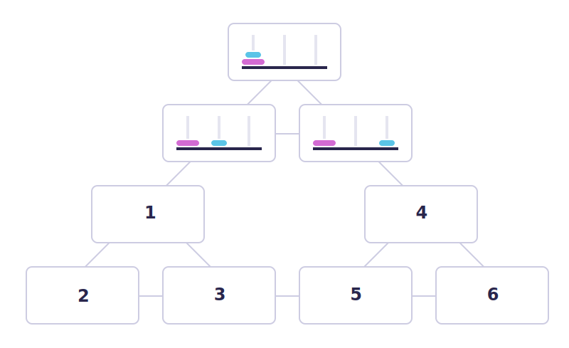

# Table of contents
[# chapter 01: what is ai](#chapter-01-what-is-ai)

[I. how should we define ai](#i-how-should-we-define-ai)
 [II. related fields](#ii-related-fields)
 [III. philosophy of ai](#iii-philosophy-ai)

[# chapter 02: ai problem solving](#chapter-02-ai-problem-solving)

[I. search and problem solving](#i-search-and-problem-solving)
 [II. solving problems with ai](#ii-solving-problems-with-ai)
 [III. search and games](#iii-search-and-games)

[# chapter 03: real world ai](#chapter-03-real-world-ai)

[I. odds and probability](#i-odds-and-probability)
 [II. the bayes rule](#ii-the-bayes-rule)
 [III. naive bayes rule](#iii-naive-bayes-classification)

[# chapter 04: machine learning](#chapter-04-machine-learning)

[# chapter 05: neural networks](#chapter-05-neural-networks)

[# chapter 06: implications](#chapter-06-implications)

# Chapter 01: what is AI?
## I. How should we define AI?
<h3>In our very first section, we'll become familiar qith the concept of AI by looking intro it's definition and some examples.</h3>
As you have probably noticed, AI is currently a "hot topic": media coverage and public discussion about AI is almost impossible to avoid. However, you may also have noticed that AI means different things to different people. For some, AI is about artificial life-forms that can surpass human intelligence, and for others, almost any data processing technology can be called AI.
To set the scene, so to speak, we'll discuss what AI is, how it can be defined, and what other fields or technologies are closely related. Before we do so, however, we'll highlight three applications of AI that illustrate different aspects of AI. We'll return to each of them throughout the course to deepen our understanding.

### **Application 01. Self-driving cars**
Self-driving cars require a combination of AI techniques of many kinds: seach and planning to find the most convenient route from A to B, computer vision to identify obstacles, and decision making under uncertainty to cope with the complex and dynamic enviroment. Each of these must work with almost flawless precision in order to avoid accidents.
The same technologies are also used in other autonomous systems such as delivery robots, flying drones, and autonomous ships.
**Implications:** road safety should eventually improe as the reliability of the systems syroassses human level. The efficiency of logistics chains when moving goods should improve. Humans move into a supervisory role, keeping an eye on what's going on while machines take care of the driving. Since transportation is such cructial element in our daily life, it is likely that there are also some implications that we haven't even thought about yet.

### **Application 02. Content Recommendation**
A lot of the information that we encounter in the course of a typical day is personalized. Examples include Facebook, Twitter, Instagram, and other social media content; online advertisements; music recommendations on Spotify; movie recommendations on Netflix, HBO and other streaming services. Many online publishers such as newspapers' and broadcasting companies' websites as well as search engines such as Google also personalizethe content they offer.
While the frontpage of the printed version of the *New York Times* or *China Daily* is the same for all readers, the frontpage od the online verrsion is different for each user. The algorithms that determine the content that you see are based on AI.
**Implications**: while many companies don'0t want to reveal the details od their algorithms, being aware of the basic principles helps you understand the potential implications: these involve so called filter bubbles, echo-chambers, troll factores, fake news, and new forms of propaganda.

### **Application 03. Image and video processing**
Face recognition is already a commodity used in many customer, business, and government applications such as organizing your photos according to people, automatic tagging on social media, and passport control. Similar techniques can be used to recognize other cars and obstacles around an anotonomous car, or the estimate [wildlife populations](https://valohai.com/showcase/marais-elephant/), just a few examples.
AI can be used to generate or alter cisual content. Examples already in use today include style transfer, by ehich you can adapt your personal photos to look like they were painted by Vincent Van Gogh, and computer generated characters in motion pictures such as *Avatar*, *the Lord of the Rings*, and popular Pixar animations where the animated characters replicate gestures made by real human actors.
**Implications**: when such techniques advance and become more widely available, it will be easy to create natural looking fake videos of events that are impossible to distingish from real footage. This challenges the notion that 'seeing is believing'.

### That is, and what isn't AI? Not an easy question!
The popularity of AI in the media is in part due to the fact that people have started using the term when they refer to things that used to be called by other names. You can see almost the anything ffrom statistics and business analytics to manually encoded if-then rules called AI. Why is this so? Why is the public perception of AI so nebolous? Let's look at a few reasons:

|   	|   	|
|---	|---	|
| 	| reason 01: no official agreed deffinition Even AI researchers have no exact definition of AI. The field is rather being constantly redefined when some topics are classified as non-AI, and new topics emerge. There's an old (geeky) joke that AI is defined as "cool things that computers can't do". The irony is taht under this definition, AI can never make any progress: as soon as we find a way to do somethind cool with a computer, it stops being an AI problem. How ever, there is an element of truth in this definition. Fifty years ago, for instance, automatic methods for search and planning were considered to belong to the domain of AI. Nowadays such methods are taught to every computer science student. Similarly, certain methods for processing uncertain information are becoming so well understood that they are likely to be moved from AI to statistics or probability very soon. 	|
|  	| reason02: the legacy of science fiction The confusion about the meaning of AI is made worse by the visions of AI present in various literary and cinematic works of science fiction. Science fiction stories often feature friendly humanoid servants that provide overly-detailed factoids or witty dialogue, but can sometimes follow the steps of Pinocchio and start to wonder if they can become human. Another class of humanoid beings in sci-fi espouse sinister motives and turn against their masters in the vein of old tales of sorcerers’ apprentices, going back to the [Golem of Prague](https://en.wikipedia.org/wiki/Golem) and beyond. Often the robothood of such creatures is only a thin veneer on top of a very humanlike agent, which is understandable as most fiction -- even since science fiction -- needs to be relatable by human readers who would otherwise be alienated by intelligence that is too different and strange. Most science fiction is thus best read as metaphor for the current human condition, and robtos could be seen as stand-ins for repressed sections of society, or perhaps our search for the meaning of life. 	|
|  	| Reason 3: what seems easy is actually hard... Another source of difficulty in understanding AI is that it is hard to know which tasks are easy and which ones are hard. Look around and pick up an object in your hand, then think about what you did: you used your eyes to scan your surroundings, figured out where are some suitable objects for picking up, chose one of them and planned a trajectory for your hand to reach that one, then moved your hand by contracting various muscles in sequence and managed to squeeze the object with just the right amount of force to keep it between your fingers. It can be hard to appreciate how complicated all this is, but sometimes it becomes visible when something goes wrong: the object you pick is much heavier or lighter than you expected, or someone else opens a door just as you are reaching for the handle, and then you can find yourself seriously out of balance. Usually these kinds of tasks feel effortless, but that feeling belies millions of years of evolution and several years of childhood practice. While easy for you, grasping objects by a robot is extremely hard, and it is an area of active study. Recent examples include [Google’s robotic grasping project](https://spectrum.ieee.org/automaton/robotics/artificial-intelligence/google-large-scale-robotic-grasping-project), and a [cauliflower picking robot](https://www.plymouth.ac.uk/research/agri-tech/automated-brassica-harvesting-in-cornwall-abc).	|
|  	|  ...and what seems hard is actually easy By contrast, the tasks of playing chess and solving mathematical exercises can seem to be very difficult, requiring years of practice to master and involving our “higher faculties” and concentrated conscious thought. No wonder that some initial AI research concentrated on these kinds of tasks, and it may have seemed at the time that they encapsulate the essence of intelligence. It has since turned out that playing chess is very well suited to computers, which can follow fairly simple rules and compute many alternative move sequences at a rate of billions of computations a second. Computers beat the reigning human world champion in chess in the famous [Deep Blue vs Kasparov matches](https://en.wikipedia.org/wiki/Deep_Blue_versus_Garry_Kasparov) in 1997. Could you have imagined that the harder problem turned out to be grabbing the pieces and moving them on the board without knocking it over! We will study the techniques that are used in playing games like chess or tic-tac-toe in Chapter 2. Similarly, while in-depth mastery of mathematics requires (what seems like) human intuition and ingenuity, many (but not all) exercises of a typical high-school or college course can be solved by applying a calculator and simple set of rules.	| 
### So what would be a more useful definition?
An attempt at a definition more useful than the "what computers can't do yet" joke would be to list properties that are characteristics to AI, in this case autonomy and adaptivity.
> key terminology
> <h2>Autonomy</h2>
>The ability to perform tasks without constant guidance by a user.
> <h2>Adaptivity</h2>
>The ability to improve performance by learning from experience.
### Words can be misleading
When defining and talking about AI we have to be cautious as many of the words that we sude can be quite misleading. Common examples are learning, understanding, and intelligence.
 You may well say, for example, that a system is intelligent, perhaps because it delivers accurate navigation instructions or detects signs of melanoma in photographs of skin lesions. When we hear sometimes like this, the word "intelligent" easily suggests that the system is capable of performing any task an intelligent person is able to perform: going to the grocery store and cooking dinner, washing and folding laundry, and so on.
  Likewise, when we say that a computer vision system understands images because it is able to segment an image into distinct objects such as other cars, pedestrians, buildings, te road and so on, the world "understand" easily suggests that the system also understands that even if a person is wearing a t-shirt that has a photo of a road printed on it, it is not okay to drive is wearing a t-shirt that has a photo of a road printed on it, it is not okay to drive on that road (and over a person).
In both of the above cases, we will be wrong.
 
> note
> ### watch out for "suitcase words"
> [Marvin Minsky](https://en.wikipedia.org/wiki/Marvin_Minsky), a cognitive scientist and one of the greatest pioneers in AI, coined the terb **suitcase word** for term that carry a whole bunch of different meanings that come along even if we intend only one of them. Using such terms increases the risk of misinterpretations such as the ones above.

It is important to realize that intelligence is not a single dimension like temperature. You can compare today's temperature to yesterday's, or the temperature In Helsinki to that in Rome, and tell which one is higher and ehicht is lower. We even have a tendency to think that it is possible to rank people with respect to their intelligence -- that's what the intelligence quotient (IQ) is supposed to. However, in the context of AI, it is obvious that different AI systems cannot be compared on a single axis or dimension in terms of their intelligence. Is a chess-playing algorithm more intelligent than a spam filter, or is a music recommendation system than a self-driving car? These questions make no sense. This is because artificial intelligence is narrow (we'll return to the meaning of narrow AI at the end of this chapter): being able to solve one problem tells us nothing about the ability to solve another, different problem.
### Why you can say "a pinch of AI" but not "an AI"
The classification into AI vs non -AI is not clear yes-no dichotomy: while some methods are clearly AI and other are clearly not AI, there are also methods that involve a pinch of AI, like a pinch of salt. Thus it would sometimes be more appropriate to talk about the "AIness" (as in happiness or awesomeness) rather than arguin whether something is AI or not.
> Note
> ### "AI" is not a countable noun
> When discussing AI, we would like to discourage the use of AI as a countable noun: one AI, two Ais, and so on. AI is a scientific discipline, like mathematics or biology. This means that AI is a collection of concepts, problems, and methods for solving them.
>  Because AI is a discipline, you shouldn't say an "AI", just like we don't say "a biology". This point should also be quite clear when you try saying something like "we need more artificial intelligences". That just sounds wrong, doesn't it? (It does to us).

Despite our discouragement, the use of AI as a countable noun is common. Take for instance, the headline [Data from wearables helped teach an AI to spot signs of diabetes](https://www.engadget.com/2018/02/07/deepheart-diabetes-cardiogram-ai/), which is otherwise a pretty good headline since it emphasizes the importance of data and makes it clear that the system can only detect signs of diabetes rather than making diagnose treatments decisions. And you should definately never say anything like [Google's Artificial intelligence built an AI that outperforms any made by humans](https://futurism.com/google-artificial-intelligence-built-ai/), which is one of the all-time most misleading AI headlines we've ever seen (note that the headline is not by Google Research).
  The use of AI as a countable noun is of course not a big deal if what is being said otherwise makes sense, but if you'd like to talk like a pro, avoid saying "an AI", an instead say "an AI method".

### Exercise 01: Is this an AI or not?
Which of the following are AI and which are not. Choose yes, no, or "kind of" where kind of means that it both can be or can't be, depending on the viewpoint.
**Note:** you will only be able to submit the answer once, so tak your time and re-read the material above if you feel like it. That said, don't worry if you get some of them wrong -- Some are debatable in any case bcause these kinds of  things are rarely perfect clear cut. We are quite sure that if you just focus and do your best, you will have no problem achieving a successful overall result in the end. Making mistakes is one of the best opportunities to learn.
1. Spreadsheet that calculates sums and other pre-defined functions on given data N
 The outcome is determined by the user-specified formula, no AI needed.
2. Predicting the stock market by fitting a curve to past data about stock prices.: Y / N / K
 Fitting a simple curve is not really AI, but there are so many different curves to choose from, even if there's a lot of data to constrain them, that one needs machine learning/AI to get useful results.
3. A navigation system for finding the fastest route. : Y / N / K
 The signal processing and geometry used to determine the coordinates isn't AI, but providing good suggestions for navigation (shortest/fastest routes) is AI, especially if variables such as traffic conditions are taken into account.
4. A music recommendation system such as Spotify that suggests music based on the users' listening behavior : Y
 The system learns from the users' (not only your) listening behavior.
5. Big data storage solutiuons that can store huge amounts of data (such as images or video) and stream them to many users at the same time. : N
 Storing and retrieving specific items from a data collection is neither adaptive or autonomous.
6. Photo editing features such as brightness and contrast in applications such as Photoshop: N / K
 Adjustments such as color balance, contrast, and so on, are neither adaptive nor autonomous, but the developers of the application may use some AI to automatically tune the filters.
7. Style transfer filters in applications such as Prisma that take a photo and transform it into different art styles (impressionist, cubist, ...): Y
 Such methods typically learn image statistics (read: what small patches of the image in a certain style look like up close) and transform the input photo so that its statistics match the style, so the system is adaptive.
## II. Related fields.
<h3>In addition to AI, there are several other closely related topics that are good to know at least by name. These include machine learning, data science and deep learning</h3>

**Machine learning** can be said to be a subfield of AI, which itself is a subfield of **computer science** (such categories are often somewhat imprecise and some parts of machine learning could be equally well or better belong to statistics). Machine Learning enables AI solutions that are adaptive. A concise definition can be given as follows:
> ### **Machine learning**
> System that improve their performance in a given task with more and more experience or data.

**Deep learning** is a subfied of machine learning, which itself is a subfield of AI, which itself is a subfield of computer science- We will meet deep learning in some more detail in Chapter 5, but for now let us just note that the "depth" of deep learning refers to the complexity of a mathematical model, and that the increased computing power of modern computers has allowed researchers to increase this complexity to reach levels that appear not only quantitatively but also qualitatively different from before. As you notice, science often involves a number of progresively more special subfields, in particular topic so that it is possible to catch up with the ever increasing amount of knowledge accrued over the years, and produce new knowledge on the toppic -- or sometimes, correct earlier knowledge to be more accurate.
 **Data science** is a recent umbrella term (term that covers several subdisciplines) that includes machine learning and statistics, certain aspects of computer science including algorithms, data storage, and web application development. Data science is also a practical discipline that requires understanding the domain in which it is applied on, for example, business or science: its purpose (what "added value" means), basic assumptions, and constraints. Data science solutions often involve at least a pinch of AI (but usually not as much as one would expect from the headlines).
 **Robotics**  means building and programming robots so that htey can operate in complex, real-world scenarios. In a way, robotics is the ultimate challenge of AI since it requires a combination of virtually all areas of AI. For example:
- Computer vision and speech recognition for sensing the enviroment
- Natural Language processing, information retrieval, and reasoning under uncertainty for processing instructions and predicting consequences of potential actions.
- Cognitive modeling and affective computing (systems that respond to expressions of human feelings or that mimic feelings) for interactive and working together with humans.

Many of the robotics-related AI problems are best approached mu machine learning, which makes machine learning a central branch of AI for robotics.
> ### **What is a robot?**
> In brief, a robot is a machine comprising sensor (which sense the enviroment) and actuators (which act on the environment) that can be programmed to perform sequences of actions. People used to science-fictional depictions of robots will usually kind of think of humanoid machines walking with an wakward gait and speaking in a metallic monotone. Most real-world robots currently in use look very different as they are designed according to the application. Most applications wpuld not benefit from the robot having human shape, just like we don't have humanoid robots to do our dishwashing but machines in which we place the dishes to be washed by jets of water. 
>  It may not be obvious at first sight, but any kinf of vehicles that vave at least some level of autonomy and include sensors and actuators are also counted as robotics. On the other hand, software-based solutions such as a customer service chatbot, even if ther are sometimes called "software robots", aren't counted as (real) robotics. 

### exercise 02: taxonomy of AI
A taxonomy is a scheme for classifying many things that may be special cases of one another. We have explained the relationships between a number of disciplines or fields and pointed out, por example, that machine learningis usually considered to be a subfield of AI.
 A convenient way to visualize a taxonomy is an Euler diagram. An Euler diagram (closely related to the more familiar Venn diagrams) consists of shapes that respond to concepts, which are organized so that overlap between the shapes corresponds to overlap between the concepts (see for example [Wikipedia: Euler diagram](https://en.wikipedia.org/wiki/Euler_diagram)).
 Notice that a taxonomy does not need to be strictly hierarchical. A discipline can be a subfield of more than one general topic: for example, machine learning can also be thought to be a subfield of statistics. In this case, the subfied concept would be placed iun the overlap between the more general topics.
 **Your task:** COnstruct a taxonomy in the Euler diagram example given below showing the relationships between the following things: AI, machine learning, computer science, data science, and deep learning.

1. AI - section B
  AI is a subfield of computer science
2. Machine learning - section C
  Machine learning is usually considered to be a part of AI
3. Computer science - section A
 Computer science is a relatively broad field that inclued AI but alos other subfieds such as distributed computing, human-computer interaction and software engineering.
4. Data science - section E
  Data science needs computer science and AI. howeer, it also involves a lot of statistics, business, law, and other application domains, so it is usually not considered to be a part of computer science.
5. Deep learning - section D
 deep learning is a part of Machine learning

### exercise 03: example of tasks
Consider the following example tasks. Try to determine which AI-related fields are involved in them. **Select all that apply** (Hint: Machine learning involves almost always some kind of statistics).
**Note:** This exercise is meant to think about the different aspects of AI and their role in various applications. As there are no clear-cut answers to many of these questions, **this exercise will not be included in the grading**. Nevertheless, we suggest that you do your best and try to answer as well as you can, but don't worry if our answer will differ from yours.
1. Autonomous car: Statistics | Robotics | Machine learning
 Autonomous cars apply a wide range of techniques to function. These include statistics, robotics and machine learning.
2. Steering a rocket into orbit: Statistics | Machine learning
 In order to steer a rocket into orbit are needed to fire the engines at the right times and with the right power.
3. Online ad optimization: 
 In order to optimize ads online, machine learning and statistics are needed to deliver the correct type of ads to the right audience, and to measure the effectiveness of the optimization.
4. Customer service chatbot: Statistics | Robotics | Machine learning
  A customer service chatbot will need machine learning to process human produced language in such a way that it can act on it.
5. Summarizing gallup results: Statistics | Robotics | Machine learning
 Summarizing gallup results is a classical case of study of using statistics to produce insights.
## III. Philosophy AI
<h3>The very nature of the term "artificial intelligence" brings up philosophical questions whether intelligent behavior implies or requires the existence of a mind, and to what extent is consciousness replicablle as computation</h3>

### The Turing test
[Alan Turing](https://en.wikipedia.org/wiki/Alan_Turing) (1912-1954) was an English mathematician and logician. He is rightfully considered to be the father of computer science. Turing was fascinated by intelligence and thinking, and the possibility of simulating them by machines. Turing's most prominent contibution to AI is his imitation game, which later became known as the [Turing test](https://en.wikipedia.org/wiki/Turing_test).
 In the rest, a human interrogator interacts with two players, A and Bm by exchanging written messages (in a chat). If the interrogator cannot determine which player, A or B, is a computer and which is a human, the computer is said to pass the test. The argument is that id a computer is indistinguishable from a human in a general natural language conversation, then it must have reached human-level intelligence.

 What Turing meant by the test is very much similar to the aphorism by Forrest Gump: "stupid is as stupid does". Turing's version would be "intelligent is as intelligent says". In other words, an entity is intelligent if it cannot be distinguished from another intelligent entity by observing its behavior. Turning just constrained the set of behaviors into discussion so that the interrogator can't base her or his decission on appearances.

### One problem: does being human-like mean you are intelligent?
One criticism of the Turing test as test for intelligence is that it may actually measure whether the computer behaves like a human more than whether it is intelligent. The test has indeed been "passed" by computer programs that keep changing the subject, make plenty of spelling errors, and sometimes refuse to respong at all. A famous example is [Eugene Gostman](https://en.wikipedia.org/wiki/Eugene_Goostman), a 13-year-old Ukranian boy who constantly tries to avoid answering questions bny making jokes and changing the subject to his pet guineapig. Here is a short segment of an example conversation with Eugene Goostman from the [blog of Scott Aronson](https://www.scottaaronson.com/blog/?p=1858):
><h4>Is Eugene a computer or a person?</h4>
>
>**Interrogator**: How many legs does a camel have?
> **Eugene**: Something between 2 and 4. Maybe, three? :-))) By the way, I still don’t know your specialty - or, possibly, I’ve missed it?
> **Interrogator**: How many legs does a millipede have?
> **Eugene**: Just two, but Chernobyl mutants may have them up to five. I know you are supposed to trick me.
> **Interrogator**: No, I need to know that you’re not a chatbot. Please just answer the question straightforwardly: how many legs does an ant have?
> **Eugene**: Something between 2 and 4. Maybe, three? :-))) Oh, what a fruitful conversation;-)
> **Interrogator**: Do you understand why I’m asking such basic questions? Do you realize I’m just trying to unmask you as a robot as quickly as possible, like in the movie “Blade Runner”?
> **Eugene**: ...wait
> *Eugene Goostman, who in reality is a computer program, fooled 10 out of 30 judges into thinking he is a real person*.

### The Chinese room argument
The idea that intelligence is the same as intelligent behavior has been challenged by some. The best known counter-argument is John Searle's [Chinese Room](http://www.iep.utm.edu/chineser/) thought experiment. Searle describes an experiment where a person who doesn't know Chines is locked in a room. Outside the roomis a person who can slip notes written in Chinese inside the room through a mail slot. The person inside the room is given a big manual where she can find detailed instructions for responding to the notes she receives from the outside.
 Searle argued that even if the person outside the room gets the impression that he is in a conversation with another Chinese-speaking person, the person inside the room does not understand Chinese. Likewise, his argument continues, even if a machine behaves in an intelligent manner, for example, by passing the Turing test, it doesn't follow that it is intelligent or that it has a "mind" in the way that a human has. The word "intelligent" can also be replaced by the word "conscious" and a similar argument can be made.

### Is a self-driving car intelligent?
The Chinese Room argument goes against the notion that intelligence can be broken down into small mechanical instrucitons that can be automated.
 A self-driving car is an example of an element of intelligence (driving a car) that can be automated. The Chinese Room argument suggests that this, however, isn't really intelligent thinking: it just looks like it. Going back to the above discussion on "suitcase words", the AI system in the car doesn't see or understand its environment, and it doesn't know how to drive safely, in the way human being sees, understands, and knows. Accoridng to Searle this means that the intelligent behavior of the system is fundamentally different from actually being intelligent.
### How much does philosophy matter in practice?
The definition of intelligence, natural or artificial, and consciousness appears to be extremely evasive and leads to apparently never-ending discourse. In intellectual company, this discussion can be quite enjoyable (in the absence of suitable company, books such as The Mind's I by Hofstadter and Dennerr can offer stimulation).
However, as [John McCarthy](http://jmc.stanford.edu/articles/aiphil/aiphil.pdf) pointed out, the philosophy of AI is "unlikely to have any more effect on the practice of AI research than philosophy of science generally has on the practice of science". Thus, we'll continue investigating systems that are helpful in solving practical problems without asking too much whether they are intelligent or just behave as they were.
> ### General Vs Narrow AI
> When reading the news, you might see the terms "general" and "narrow" AI. So what do these mean? Narrow AI refers to AI that handles one task. General AI, or Artificial  General Intelligence (AGI) refers to a machine that can handle any intellectual task. All the AI mehtods we use today fall under narrow AI, with general AI being the realm of science fiction. In fact, the ideal of AGI has been all but abandoned by the AI researchers of lack of progress towards it in more than 50 years despite all the effort. In contrast, narrow AI makes progress in leaps and bounds.
> ### Strong Vs Weak AI
> A related dichotomy is "strong" and "weak" AI. This boils down to the above philosophical distinction between being intelligent and acting intelligently, which was emphasize by Searle. Strong AI would amount to a "mind" that is genuinely intelligen and self-conscious. Weak AI is what we actually have, namely systems that eshibit intelligent behaviors despite being "mere" computers.

### exercise 04: definitions, definitions
Which definition of AI do you like the best? how would *you* define AI?
Let's first scrutinize the following definitions that have been proposed earlier:
1. "cool things that computers can't do"
2. machines imitating intelligent behavior 
3. autonomous and adaptive systems

**Your tasks:**
- Do you think these are good definitions? Consider each of them in turn and try to come up with things that they get wrong -- either things that you think should be counted as AI but aren't according to the definition, or vice versa. **Explain your answers by a few senteces per item** (so just saying that all definition look good or bad isn't enough).
- Also come up with **your own, improved definition** that solves some of the problems that you have identified with the above candidates. Explain in a few sentences how your definition may be better thatn the above ones.

**Please read the above instructions carefully and answer both of the items above in the text box below. Your answer will be reviewed by other users and by the instructors. Please answer in English, and check your answer before clicking 'submit' because once submitted, you can no longer edit your answer.**
- An AI is a way that a computer can answer to problems automatically, by no human interference. There are some tasks that they can manage to do, but some others like ethical decissions still cannot be accomplished byt the machine -- because the machine doesn't actually have a conscience, it just can solve efficiently a more logical task.
- As the machine imitates the human behavior, it gives the optimal answer to a specific question. If there's a new question, probably the machine won't answer as perfect as it did before because normally AI's are trained to do one specific task.
- AI is autonomous, because it "learns" by itself, and adapts to the different conditions that the problem may have. The thing is that at this point AI's are actually more narrow than they are general -- it's easier for the machine to give a more concrete answer to a concrete problem that have a general tool, that can generate different outputs for different problems.

There is no right or wrong answer, but here’s what we think:

“Cool things that computers can't do"

The good: this adapts to include new problems in the future, captures a wide range of AI such computer vision, natural language processing.

The bad: it rules out any "solved" problems, very hard to say what counts as "cool".

“Machines imitating intelligent human behavior”

The good: the same as in the previous. Also, imitate is a good word since it doesn't require that the AI solutions should "be" intelligent (whatever it means) and it's instead enough to act intelligently.

The bad: the definition is almost self-referential in that it immediately leads to the question what is 'intelligent', also this one is too narrow in the sense that it only includes human-like intelligent behavior and excludes other forms of intelligence such as so-called swarm intelligence (intelligence exhibited by for example ant colonies).

“Autonomous and adaptive systems”

The good: it highlights two main characteristics of AI, captures things like robots, self-driving cars, and so on, also nicely fits machine learning-based AI methods that adapt to the training data.

The bad: once again, these lead to further questions and the definition of 'autonomous' in particular isn't very clear (is a vacuum cleaner bot autonomous? How about a spam filter?). Furthermore, not all AI systems need to be autonomous and we can in fact often achieve much more by combining human and machine intelligence.
## Recap
<h3>After completing chapter 1, you whould be able to:</h3>

- Explain autonomy and adaptivity as key concepts for explaining AI
- Distingish between realistic and unrealistic AI (science fiction vs. real life)
- Express the basic philosophical problems related to AI including the implications of teh Turing test and Chinese room thought experiment.

# Chapter 02: AI problem solving
## I. Search and problem solving
<h3>Many problems can be phrased as searched problems. THis requires that we start by formulating the alternative choices and their consequences.</h3>

### Search in practice: getting from A to B
Imagine you're in a foreign city at some address (say a hotel) and want to use public transport to get to another adress (a nice restaurant, perhaps). What do you do? If you are like many people, you pull your smartphone, type in the destination and start following the instructions. 
 
 This questions belongs to the class of search and planning problems. Similar problems need to be solved by self-driving cars, and (perhaps obviously) AI for playing games. In the game of chess, for example, the difficulty is not so much in getting a piece from A to B as keeping your pieces safe from opponent.

 Often there are many different ways to solve the problem, some which may be more preferable in terms of time, effort, cost or other criteria. Different search techniques may lead to different solutions, and developing advanced search algorithms is an established research area.

 We will not focus in the actual search algorithms. Instead, we emphasize the first stage of the problem solving process: defininf the choices and their consequences, which is often far from trivial and can require careful thinking. We also need to define what our goal is, or in other words, when we can consider the problem solved. After this has been done, we can look for a sequence of actions that leads from the initial state to the goal.
 In this chapter we will discuss two kinds of problems:
- Search and planning in static environments with only one "agent".
- Games with two-players ("agents") competiongn against each other.

These categories don't cover all possible real-world scenarios, but they are generic enough to demonstrate the main concepts and techniques.
 Before we address complex search tasks like navigation or playing chess, let us start from a much simplified model in order to build up our understanding of how we can solve problems by AI.
 
### Toy problem: chicken crossing
We'll start from a simple puzzle to illustrate the ideas. A robot on a rowboat needs to move three pieces of cargo accross a river: a fox, a chicken and a sack of chicken-feed. The fox will eat the chicken if it has the chance, and the chicken will eat the chicken-feed if it has the chance, and neither is a desirable outcome. The robot is capable of keeing the animas from going harm when it is near them, but only the robot can operate the rowboat and only teo of the pieces of cargo can fit on the rowboat together with the robot. How can the robot move all of its cargo to the opposite bank of the river?
> <h3>The easy version of the rowboat puzzle</h3>
>If you have heard this riddle before, you might know that it can be solved even with less space on the boat. That will be an exercise for you after we solve this easier.
 We will model the puzzle by nothing that five movable things have been identified: the robot, the rowboat, the fox, the chicken, and the chicken-feed. In principle, each of the five can be on either side of the river, but since only the robot can operate the rowboat, the two will always be on the same side. Thus there are four things with two possible positions for each, which makes for sixteen combinations, which we will call states:
<h3>States of the chicken crossing puzzle</h3>

| State 	| Robot 	| Fox 	| Chicken 	| Chicken-feed 	|
|---	|---	|---	|---	|---	|
| NNNN 	| Near side 	| Near side 	| Near side 	| Near side 	|
| NNNF 	| Near side 	| Near side 	| Near side 	| Far side 	|
| NNFN 	| Near side 	| Near side 	| Far side 	| Near side 	|
| NNFF 	| Near side 	| Near side 	| Far side 	| Far side 	|
| NFNN 	| Near side 	| Far side 	| Near side 	| Near side 	|
| NFNF 	| Near side 	| Far side 	| Near side 	| Far side 	|
| NFFN 	| Near side 	| Far side 	| Far side 	| Near side 	|
| NFFF 	| Near side 	| Far side 	| Far side 	| Far side 	|
| FNNN 	| Far side 	| Near side 	| Near side 	| Near side 	|
| FNNF 	| Far side 	| Near side 	| Near side 	| Far side 	|
| FNFN 	| Far side 	| Near side 	| Far side 	| Near side 	|
| FNFF 	| Far side 	| Near side 	| Far side 	| Far side 	|
| FFNN 	| Far side 	| Far side 	| Near side 	| Near side 	|
| FFNF 	| Far side 	| Far side 	| Far side 	| Far side 	|
| FFFN 	| Far side 	| Far side 	| Far side 	| Far side 	|
| FFFF 	| Far side 	| Far side 	| Far side 	| Far side 	|

We have given short names to the states, because otherwise it would be cumbersome to talk about them. Now we can say that the starting state is NNNN and the goal state is FFFF, instead od something like "in the starting state, the robot is on the near side, the foz is on the near side, the chicken is on the near side, and also the chicken-feed is on the near-side", and so on.
 Some of these are forbidden by the puzzle conditions. For example, in state NFFN (meaning that the robot is on the near side, with the chicken-feed byt the fox and the chicken are on the far side), the fox will eat the chicken, which we cannot have. Thus we can rule out states `NFFN`, `NFFF`, `FNNF`, `FNNN`, `NNFF`, and `FFNN` (you can check each one if you doubt ourreasoning). We are left with the following ten states:

| State 	| Robot 	| Fox 	| Chicken 	| Chicken-feed 	|
|---	|---	|---	|---	|---	|
| NNNN 	| Near side 	| Near side 	| Near side 	| Near side 	|
| NNNF 	| Near side 	| Near side 	| Near side 	| Far side 	|
| NNFN 	| Near side 	| Near side 	| Far side 	| Near side 	|
| NFNN 	| Near side 	| Far side 	| Near side 	| Near side 	|
| NFNF 	| Near side 	| Far side 	| Near side 	| Far side 	|
| FNFN 	| Far side 	| Near side 	| Far side 	| Near side 	|
| FNFF 	| Far side 	| Near side 	| Far side 	| Far side 	|
| FFNF 	| Far side 	| Far side 	| Near side 	| Far side 	|
| FFFN 	| Far side 	| Far side 	| Far side 	| Near side 	|
| FFFF 	| Far side 	| Far side 	| Far side 	| Far side 	|

Next we will figure out which state transitions are possible, meaning simply that as the robot rows the boat with some of the items as cargo, what the resulting state in each case. It's best to draw a diagram of the transitions, and since any transition the first letter alternates between N and F, it is convenient to draw the states starting with N (so the robot is on the near side) in one row and the states starting with F in another row:
 
 Now let's draw the transitions. We could draw arrows that have a direction so that they point from one node to another, but in this puzzle the transitions are symmetric: if the robot can row state `NNNN` to state `FNFF`, it can equally well row the other way from `FNFF` to `NNNN`. Thus is simpler to draw the transitions simply with lines that don't have lines that don't have a direction. Starting from `NNNN`, we can go to `FNFF`, `FNFN`, `FNFF`, and `FFFN`:
 
 Then we will fill in the rest:
 
 We have done quite a bit of work on the puzzle without seeming any closer to the solution, and ther is little doubt that you could have solved the whole puzzle already by using your "natural intelligence". But for more complex problems, where the number of possible solutions grows in the thousands and in the millions, our systematic or mechanical approach will shine since the hard part will be suitable for a simple computer to do. Now that we have formulated the alternative states and transitions between them, the rest becomes a mechanical task: find a path fro mthe initial state `NNNN` to the final state `FFFF`.
 One such path is colored in the following picture. The path proceeds from `NNNN` to `FFFN` (the robot takes the fox and the chicken to the other side), thence to `NFNN` (the robot takes the chicken back on the starting side) and finally to `FFFF` (the robot can now move the chicken and the chicken-feed to the other side).
 
### State space, transitions, and costs
To formalize a planning problem, we use concepts such as the state space, transitions, and costs.
> <h3>The state space</h3>
>means the set of posible situations. In the chicken-crossing puzzle, the state space consisted of ten allowed states `NNNN` trough to `FFFF` (but not for example `NFFF`, which the puzzle rules don't allow). If the task is to navigate from place A to place B, the state space could be the set of locations defined by their (x, y) coordinates that can be reached from the starting point A. Or we could use a constrained set of locations, for example, different street addresses so that the number of possible states is limited.
><h3>Transitions</h3>
>are possible moves between one state and another, such as `NNNN` to `FNFN`. It is important to note that we only count direct transitions that can be accomplished with a single action as transitions. A sequence of multiple transitions, for example, from A to C, from C to D, and from D to B (the goal), is a path rather than a transition.
><h3>Costs</h3>
>refer to the fact that, oftentimes the different transitions aren't all alike. They can differ in ways that make some transitions more preferable or cheaper (in a not necessarily monetary sense of the word) and others more constly. We can express this by associating with each transition a certain cost. If the goal is to minimize the total distance traveled, then a natural cost is the geographical distance between states. On the other hand, the goal could actually be to minimize the time instead of the distance, in which case the natural cost would obviously be the time. If all the transations are equal, then we can ignore the costs.
### exercise05: A smaller rowboat
In the traditional version of this puzzle the robot can only fit one thing on the boat with it. The state space is still the same, but fewer transitions are possible.
 **Using the diagram with the possible states below as a starting point, draw the possible transitions to it** (it is MUCH easier to do this with a pen and paper than without).
 Having drawn the state transition diagram, **find the shortest path from NNNN to FFFF, and calculate the number of transitions on it**.
 Please type your answer s the **number of transitions in the shortest path** (just as a sible number like "12"). Hint: do *not* count the number od states, but the number of transitions. For example, the number of transitions in the path `NNNN`->`FFNF`->`NFNF`->`FFFF` is *3* instead of 4.
 
>The correct answer is 7. There are two shortest paths that lead from the start `NNNN` to the goal `FFFF`. One of them is `NNNN` -> `FNFN` -> `NNFN` -> `FFFN` -> `NFNN` -> `FFNF` -> `NFNF` -> `FFFF`, and the other `NNNN` -> `FNFN` -> `NNFN` -> `FNFF` -> `NNNF` -> `FFNF` -> `NFNF` -> `FFFF`. Intuitively, the strategy is to move the chicken on the other side first, and then go back get either the fox or the feed, and take it to the far side too. The robot then takes the chicken back to the near side to save it from being eaten or from eating the feed, and takes the other remaining object (fox or feed) from the near side to the far side. Finally, the robot goes to fetch the chicken and takes it to the far side to reach the goal.
### exercise06: the towers of Hanoi
Let's do another puzzle: the well-known [Towers of Hanoi](https://www.britannica.com/topic/Tower-of-Hanoi). In our version, the puzzle involves three pegs, and two discs: one large, and one small (actually, there can be any number of discs but the exercise, two is enough to demonstrate the principle).
 In the initial state, both discs are stacked in the first (leftmost) peg. The goal is to move the discs to the third peg. You can move one disc at a time, from any pe to another, as long as there is no other disc on top of it. It is not allowed to put a larger disc on top of a smaller disct.
 This picture shows the initial state and the ogal state. There are also seven other states so that the total number of possible states in nine: three ways to place the large disc and for each of them, three was to place the small disc.
 
 **Your task**: Draw the state diagram. The diagram should include all the nine possible states in the game, connected by lines that show the possible transitions. The pictures below shows the overall structure of the state diagram and the positions of the first three states. It shows that from the starting state (at the top corner), you can move to two other states by moving the small disc. Complete the state diagram by placing the remainig states in the correct places. Note that the transitions are again symmetric and you can also move sideways (left or right) or up in the diagram.
 After solving the task using pen and paper, enter your solution by choosing which state belongs to which node in the diagram. (Hint: each state belongs to exactly one node).
 
 **Choose for each node (1-6 in the above diagram the correct state A-F from below**
 
- box1: State E is the only option that is reachable from the left box on the second row.
- box2: Since box 1 contains state E, there are two possibilities for box 2: states B and F. Choosing state F in box 2 would lead to a dead-end at box 5, so the correct option must be state B. Also note that box 2 has two transitions to other states, which implies that it must be a state where the two discs are on top of each other.
- box3: Since box 1 contains state E, there are two possibilities for box 3: states B and F. Choosing state B would lead to a dead end in box 5, so the correct choice must be state F.
- box4: State D is the only option that is reachable from the right box on the second row.
- box5: Since box 4 contains state D, there are two possibilities for box 5: states A and C. Choosing state A would lead to a dead end in box 3, so the correct choice must be state C.
- box6: Since box 4 contains state D, there are two possibilities for box 6: states A and C. Choosing state C would lead to a dead end in box 5, so the correct choice must be state A. Also note that box 6 has two transitions to other states, which implies that it must be a state where the two discs are on top of each other.

## II. Solving problems with AI
### Interlude on the story of AI: starting from search
AI is arguably as old as computer science. Long before we had computers, people thought of the possibility of automatic reasoning and intelligence. As we already mentioned in [chapter 1](#chapter-1), one of the great thinkers who considered this question was Alan Turing. In addition to the Turing test, his contributions to AI, and more generally to computer science, include the insight that anything that can be computed (= calculated using either numbers or other symbols) can be automated.
> ### Helping win WWII
>  Turing designed a very simple devcie that can compute anything that is computable. His device is known as the Turing machine. While it is a theoretical model that isn't practically useful, it lead Turing to the invention of programmable computers: computers that can be used to carry out different tasks depending on what they were programmed to do.
> So instead of having to build a different device for each task, we use the same computer for many tasks. This is the idea of programming. Today its invention sounds trivial but in Turing's days it was far from it. Some of the early programmable computers were used during World War II to crack German secret codes, a project where Turing was also personally involved.

The term Artificial Intelligence was coined by John McCarthy (1927-2011) - who was refered as the father of AI. The term became stablished when it was chosen as the topic of a summer seminar, known as the [Darmouth conference](https://en.wikipedia.org/wiki/Dartmouth_workshop), which was organized by McCarthy and others in 1956 at Dartmouth college in New Hampshire. In the proposal to organize the seminar, McCarthy continued with Turing's argument about automated computation. The proposal contains the following crucial statement:
><h3>John McCarthy key statement about AI</h3>
> "The study is to proceed on the basus of the conjeture that every aspect of learning or any other feature of intelligence can in principle be so precisely described that a machine can be made to simulate it."

In other words, any element of intelligence can be broken down into small steps so that each of the steps is a such so simple and "mechanical" that it can be written down as a computer program. This statement was, and is still today, a conjeture, which means that we can't really prove it to be true. Nevertheless, the idea is absolutely fundamental when it comes to the way we think about AI.
For example, it shows that McCarthy wanted to bypass any arguments in the spirit of Searle's Chinese Room: intelligence is intelligence even if the system that implements it is just a computer that mechanically follows a program.
### Why search and games became central in AI research
As computers developed to the level where it was feasible to experiment with practical AI algorithms in the 1950s, the most distinctive AI problems (besides cracking Nazi codes) were games. Games provided a convenient restricted domain that could be formalized easily. Board games such as checkers, chess, and recently quite predominently Go (an extremely complex strategy board game originating from China at leas 2500 years ago), have inspired countless researchers, and continue to do so.
 Closely related to games, search and planning techniques were an are where AO led to great advances in the 1960s: algorithms with names such as the Minimax algorithm or Alpha-Beta Pruning, which were developed then, are still the basis for game playing AI, although of course more advanced variants have been proposed over the years. In this capter, we will study games and planning problems on a conceptual level.
## III. Search and games
<h4>In this section, we will study a classic AI problem: games. The simplest scenario, which we will focus on for the sake of clarity, are two-player, perfect-information games such as tic-tac-toe and chess.</h4>

### Example: playing tic tac toe
Maxine and Minnie are true game enthusiasts. THey just love games. Especially two-person, perfect information games such as tic-tac-toe or chess. One day they were playing tic-tac-toe. Maxine, or Max, as her friends call her, was playing with X. Minnie, or Min as her friends call her, had the Os. Min had just played her turn and the board looked as follows:
 
 Max was looking at the board and contemplating her next move, as it was her turn, when she suddenly buried her face in her hands in despai, looking quite like Garry Kasparov playing Deep Blue in 1997.
 Yes, Min was close to getting three Os on the top row, but Max could easily put a stop to that plan. So why was Max so pesimistic?
### Game trees
To solve games using AI, we will intoduce the concept of a game tree. The different states of the game are represented by nodes in the game tree, very similar to the above planning problems. The idea is just slightly differnet. In the game tree, the nodes are arranged in levels that correspond to each player's turns in the game so that the "root" node of the tree (usually depicted at the top of the diagram) is the beginning position in the game. In tic-tac-toe, this would be the empty grid with no Xs or Os played yet. Under root, on the second level, there are the possible states that can result from the fist player's moves, be it X or O. We call these nodes the "children" of the root node.
 Each node on the second level, would further have as its children nodes the states that can be reached from it by the opposing player's moves. This is continued, level by level, until reaching states where the game is over. In tic-tac-toe, this means that either one of the players gets a line of three and wins, or the board is full and the game ends in a tie.
### Minimizing and Maximizing value
In order to be able to create game AI that attempts to win the game, we attach a numerical value to each possible end result. To the board positions where X has a line of three so that Max wins, we attach the value +1, and likewise, to the position where min wins with three Os in a row we attach the value -1. For the positions where the board is full and neither player wins, we use the neutral value 0 (it doesn't really matter what the values are as long as they are in this order so that Max tries to maximize the value, and Min tries to minimize it).
#### A sample game tree
Consider, for example, the following game tree which begins not at the root but in the middle of the game (because otherwise, the tree would be way too big to dsiplay). Note that this is different from the game shown in the illustration in the beginning of this section. We have numbered the nodes with numbers 1, 2, ..., 14.
 The tree is composed of alternating layers where it is either Min's turn to place an O or Max's turn to place an X at any of the vacant slots on the board. THe player whose turn it is to play next is shown at the left.
 
 The game continues at the board position shown in the root node, numbered as (1) at the top, with Min's turn to place O at any of the three vacant cells. Nodes (2)-(4)  show the board positions resulting from each of the three choices respectively. In the next step, each node has two possible choices for Max to play X each, and so the tree branches again.
 When starting from the above starting position, the game always ends in a row of three: in nodes (7) and (9), the winner is Max who plays with X,and in nodes (11)-(14) the winner is Min who plays with O.
 Note that since the players' turn alternate, the levels can be labeled as Min levels and Max levels, which indicate whose turn it is.
### Being stategic
 Consider nodes (5)-(10) on the second level from the bottom. In nodes (7) and (9), the game is over, and Max wins with three X's in a row. The value of these positions is +1. In the remaining nodes (5), (6), (8) and (10), the game is also practically over, since Min only needs to place her O in the only remaining cell to win. In other words, we know how the game will end at each node on the second level from the bottom. We can therefore decide that the value of nodes (5), (6), (8) and (10) is also -1.
 
 Here comes the interesting part. Let's consider the values of the nodes one level higher towards the root: nodes (2)-(4). Since we observed that both of thechildren of (2), i.e., nodes (5) and (6), lead to Min0s victory, we can without hesitation attach the value -1 to node (2) as well. However, for node (3), the left child (7) leads to Max's victory, +1, but the right child (8) leads to Min winning, -1. What is the valye of node (3)? Think about this for a while, keeping in mind who makes the coice at node (3).
 Since it is Max's turn to play, she will of course choose the left child, node (7). Thus, every time we reach the board position in node (3), Max can ensure victory, and we can attach the value +1 to node (3).
 The same holds for node (4): again, since Max can choose where to put her X, she can always ensure victory, and we attach the value +1 to node (4).
 
### Determining who wins
 The most important lesson in this section is to apply the above kind of reasoning repeatedly to determine the result of the game in advance from any board position.
 So far, we have decided that the value of node (2) is -1, which means that if we end up in such a board position, Min can ensure winning, and that the reverse holds for nodes (3) and (4): their value is +1, which means that Max can be sure to win if she only plays her own turn wisely.
 Finally, we can deduce that since Min is an experienced player, she can reach the same conclusion, and thus she only has one real option: play the O in the middle of the board.
 In the diagram below, we have included the value of each node as well as the optimal game play starting at Min's turn in the root node.
 
### The value of the root node = who wins
 The value of the root node, which is said to be the value od the game, tells uys who wins (and how much, if the outcome is not just win or lose): Max wins if the value of the game is +1, Min if the value is -1, and if the value is 0, then the game will end in a draw. In other games, the value may also take other values (such as the monetary value of the chips in front of you in poker for example).
 This all is based on the assumption that both players choose what is best for them and that what is best for one is the worst for the other (so called "zero-sum game").
> <h3>Finding the optimal moves</h3>
> Having determined the values of all the nodes in the game tree, the optimal moves can be deduced: at any Min node (where it is Min's turn), the optimal choice is given by the child node whose value is minimal, and conversely, at any Max node (where it is Max's turn), the optimal choice is given by the child node whose value is maximal. Sometimes there are many equally good choices that are, well, equally good, and the outcome willl be the same no matter which one of them is picked.
### The Minimax algoithm
We can exploit the above concept of the value of the game to obtain an algorithm called the Minimax algorithm. It guarantees optimal game play in, theretically speaking, any deterministic, two-person, perfect-information zero-sum game. Given the state of the game, the algorithm simply computes the values of the children of the given state and chooses the one that has the maximum value if it is Max's turn, and the one that has the minimum value if it is Min's turn.
 The algorithm can be implemented using a few lines of code. However, er will be satisfied with having grasped the main idea. If you are interested in taking a look at the actual algorithm (alert: programming required) feel free to check out, for example, [Wikipedia: Minimax](https://en.wikipedia.org/wiki/Minimax#Minimax_algorithm_with_alternate_moves).

### COunds good, can I go home now?
As stated above, the Minimax can be used to implement optimal game play in any deterministic, two-player, perfect-informtion zero-sum game. Such games include tic-tac-toe, connect four, Go, etc. Rock-paper-scissors is not in this class of games since it involves information hidden from the other player; nor are Monopoly or backgammon which are not deterministic. So far as this topic is concerned, is that all folks, can we go home now? The answer is that in theory, yes, but in practice, no.
> <h3>The problem of massive game trees</h3>
> In many games, the game tree is simply way too big to traverse in full. For example, in chess the avarage branching factor, i.e., the average number of children (available moves) per node is about 35. That means that to explore all the possible scenarios up to only two moves ahead, we need to visit approximately 35 x 35 = 1225 nodes - probably not your favorite pencil-and-paper homework exercise. A look-ahead of three moves requires visiting 42875 nodes; four moves 1500625; and ten moves 2758547353515625 (that’s about 2.7 quadrillion) nodes. In Go, the average branching factor is estimated to be about 250. Go means no-go for Minimax.
### More tricks: Managing massive game trees
A few more tricks are needed to manage massive game trees. Many of them were crucial elements in IBM's Deep Blue computer defeating the chess world champion Garry Kasparov in 1997.
 If we can afford to explore only a small part of the game tree, we need a way to stop the Minimax algorithm before reaching an end-node, i.e., a node where the game is over and the winner is known. This is achieved by using a so called **heuristic evaluation function** that takes as input a board position,m including the information about which player's turn is next, and returns a score that should be an estimate of the likely outcome of the game continuing from the given board position.
> <h3>Good heuristics</h3>
>Good heuristics for chess, for example, typically count the amount of material (pieces) wighted by their type: the queen is usually considered worth about two times as much as a rook, three times a knight or a bishop, and nine times as much as a pawn. The king is of course worth more than all other things combined since losing it amounts to losing the game. Further, occupying the strategicaly important positions near the middle of the board is considered an advantage and the heuristics assign higher value to such positions.

The Minimax algorithm presented above requiers minimal changes to obtain a **depth-limited** version where the heuristic ius returned at all nodes at a given depth limit: the depth simply refers to the number of steps that the game is expanded before applying a heuristic evaluation funcion.
### exercise07: why so pessimistic, Max?
Let's return to the tic-tac-toe game described in the beginning of this section. To narrow down the space of possible end-games to consider, we can observe that Max must clearly place an X on the top row to avoid imminent defeat:
 
 Now it's Min's trun to play an O. Evaluate the value of this state of the game as well as the other states in the game tree where the above psition is the root, using the Minimaz algorithm.
 **Your task**:
 Look at tge game tree starting from the below board position. Using a pencil and paper, fill in the values of the bottom-level nodes where the game is over. Note that this time some of the games end in a draw, which means that the values of the node is 0 (instead of -1 or 1).
 Next continue filling the values of the nodes in the next level up. Since there is no branching at that level, the values on the second-lowest level are the same as at the bottom level.
 On the second-highest level, fill in the values by choosing for each node the maximum of the values of the child nodes - as you notice, this is a MAX level. Finally, fill in the root node's value by choosing the minimum of the root node's child nodes' values. This is the value of the game.
 **Enter the value of the game as your answer**.
 
 The value is –1. The values on the second level are 0, 0, and –1. The values on the third level are –1, 0, –1, 0, –1, –1, which are the same as the values on the bottom level. As you can see, Max has all the reason to be serious since by playing in the bottom-right corner, Min can guarantee a win. The inevitable victory of Min can also be seen from the value of the game –1.
><h3>The limitations of plain search</h3>
>It may look like we have a method to solve any problem by specifying the states and transitions between them, and finding a path from the current state of our goal. Alas, things get more complicated when we want to apply AI in real world problems. Basically, the number of states in even a moderately complex real-world scenario grows out of hand, and we can't find a solution by exhaustive search ("brute force") or even by using clever heuristics.
> Moreover, the transitions which take us from one state to the next when we choose an action are not deterministic. This means that whatever we choose to do will not always completely determine the outcome because there are factors that are beyond our control, and that are often unknown to us.
> The algorithms we have discussed above can be adapted to handle some randomness, for example randomness in choosing cards from a shuffled deck or throwing dice. This means that we will need to introduce the concept of uncertaintiy and probability. Only thus we can begin to approach real-world AI instead of simple puzzles and games. This is the topic of Chapter 3.
## Recap
- Formulate a real-world problem as a search problem.
- Formulate a simple game (such as tic-tac-toe) as a game tree
- Use the minimax principle to find optimal moves in a limited-soze game tree

# Chapter 03: Real world AI
## I. Odds and probability
<h3>In the previous section, we discussed search and its application where there is perfect information - such as in games like chess. However, in the real world things are rarely so clear out.</h3>
Instead of perfect information, there is a host of unknown possibilites, ranging from missing information to deliberate deception.
 Take a self-driving car for example - you can set the goal to get from A to B in an eficient and saf manner that follows all laws. But what happens if the raffic gets worse than expected, maybe because of an accident ahead? Sudden bad weather? Random events like a ball bouncing in the street, or a piece of trash flying straight into the car's camera?

 
 A self driving car needs to use a variety of sensors, including solar-like ones and cameras, to detect where it is and what is around it. These sensors are never perfect as the data from the sensors always includes some errors and inaccuracies called "noise". It is very common then that one sensor indicates that the road ahead turns left, but another sensor indicates the opposite direction. This needs to be resolved without always stopping the car in case of even a slightest amount of noise.
### Probability
One of the reasons why modern AI methods actually works in real-world problems - as opposed to most of the earlier "good old-fashioned" methods in the 1960-1980s - is their anility to deal with uncertainty.
><h3>The history of dealing with uncertainty</h3>
>The history of AI has seen various competing paradigms for handling uncertain and imprecise information. For example, you may have heard of fuzzy logic. Fuzzy logic was for a while a contender for the best approach to handle uncertain and imprecise information and used in many customer-applications such as washing machines where the machine could detect the dirtiness (a matter of degrees, not only dirty or clean) and adjust the program accordingly.
> However, probability has turned out to be the best approach for reasoning under uncertainty, and almost all current AI applications are based, to at least some degree, on probabilities.
 
### Why probability matters
We are perhaps most familiar with applications of probability in games: what are the chances of getting three of a kind in poker (about 1 in 47), what are the chances of winning in the lottery (very small), and so on. However, far more importantly, probability can also be used to quantify and compare risks in everyday life: what are the chancs of crashing your car if you exceed the speed limit, what are the chances that the interest rates on your mortgages will go up by five percentage points within the next five years, or what are the chances that AI will automate particular tasks such as detecting fractured bones in X-ray images or wating tables in a restaurant.
><h3>The key lesson about probability</h3>
>The most important lesson about probability that we'd like to take away is not probability calculus. Instead, it is the ability to think that we can talk about uncertainty as if it were a number: numbers can be compared ("is this thing more probable than that thing"), and they can often be measured.
> Granted, measuring probabilities is hard: we usually need many observations about a phenomenon to draw conclusions. However, by systematically collecting data, we can critically evaluate probabilistic statements, and our numbers can sometimes be found to be right or wrong. In other words, the key lesson is that uncertainty is not beyond the scope of rational thinking and discussion, and probability provides a sustematic way of doing just that.
 The fact that uncertainty can be qualified is a paramount importance, for example, in decisions concerning vaccination or other public policies. Before entering the market, any vaccine are never knwon to the minutest detail, but their magnitude is usually known to sufficient degree that it can be argued whether the benefits outweight the risks.
><h3>Why quantifying uncertainty matters</h3>
>if we think of unmcertainty as somethin that can't be qua, the uncertainty aspect may become an obstacle for rational discussion. We may for example argue that since we don't know exactly whether a vaccine may cause a harmful side-effect, it is too dangerous to use. However, this may lead us to ignore a life-threatening disease that the vaccine will eradicate. In most cases, the benefits and risks are known to sufficient precission to clearly see that one is more significant then the other.
 The above lesson is useful in many everyday scenarios and profesinally: for example, medical doctors, judges in a court of law, or investors have to process uncertain information and make rational decidions based on them. Since this is an AI course, we will discuss how probability can be used to automate uncertain reasoning. The examples we will use include medical diagnosis (although it is usually not a task that we'd wish to fully automate), and identifying fraudulent email messages ("spam").
### exercise08: probabilistic forecast
For this exercise, remember the key points from the above discussion: probability can be quantified (expressed as a number) and it can be right or wrong. But also keep in mind, that it is usually not possible to draw conclusions about wheter a particular number was right or wrong based on a single observation.
 Consider the following four probabilisitc forecast and outcomes. What can we conclude based on the outcome about the correctness od the forecasts? Can we conclude that the probability given by the forecast was indeed **the** correct probability (choose "right"), taht hte forecast was worng (choose "wrong"), or can we conclude neither way (choose "cannot be concluded")?
- The weather forecast says it's going to rain with 90% probability tomorrow but the day turns out to be all sun and no rain. -- cannot be concluded.
 We can't conclude that the weather forecast was wrong based on only the single event. The forecast said it's going to rain with 90% probability, which means it would not rain with 10% probability or in one out of 10 days. It is perfectly plausible that the day in question was the 1 in 10 event. Concluding that the probability 90% was correct would also be wrong because by the same argument, we could then conclude that 80% chance of rain was also correct, and both cannot be correct at the same time.
- The weather forecast says it's going to rain with 0% probability tomorrow but the day turns out to be rainy. - wrong
 The weather forecast was wrong because a 0% probability means that it should definitely not rain. But it did.
- Suppose you monitor a weather forecaster for a long time. You only consider the days for which the forecast gives 80% chance of rain. You find that in the long run, on the average it rains on three out of every five days. - Wrong.
 The weather forecasts are wrong if they predict 80% chance of rain and it rains only 60% (three out of five) of the time in the long run. (Note that we'd really need to keep track of the accuracy for a long time to reach this conclusion but that's what "in the long run" means.) In practice, weather forecasters actually tend to provide this kind of 'wrong' predictions just to be safe: people are often quite disappointed when the weather turns out to be worse than predicted but pleasantly surprised when it turns out better than predicted.
-In the United States presidential election 2016, a well-known political forecast blog, Five-Thirty-Eight, gave Clinton a 71.4% chance of winning (vs Trump's 28.6%). However, contrary to the prediction, Donald Trump was elected the 45th president of the United States.
 Cannot be concluded to be wrong (or right). Sometimes unlikely things happen. Considering the previous item, it would actually have been wrong to predict, say, 90% or 100% chance for Trump if there simply isn't enough information available to anticipate the outcome. In other words, perhaps Trump's victory was a rare (or rareish) event with 28.6% probability. Such events are expected to happen in more than one out of four cases, after all.
### Odds
Probably the easiest way to represent uncertainty is through odds. They make it particularly easy to update beliefs when more information becomes available (we will return to this in the next section).
 Before we proceed any further, we should make sure you are comfortable with doing basics manipulations on ratios (or fractions). As you probably recall, fractions are numbers like 3/4 pr 21/365. We will need tp mulstiply and divide such things, so it's good to refresh these operations if you fell unsure about them. A compact presentation for those who just need a quick reminder is [Wikibooks: Multiplying fractions](https://en.wikibooks.org/wiki/Arithmetic/Multiplying_Fractions). Another fun animated presentation of the basic operations is [Math is Fun: Using rational numbers](https://www.mathsisfun.com/algebra/rational-numbers-operations.html). Feel free to consult our favorite source if necessary.
 By odds, we mean an expression like 3:1 (three to one), which means that we wxpect that for every three cases of an outcome, for example winning a bet, there is one case of the opposite outcome, not winning the bet. (In gambling terms, the odds are usually given from the bookmakers point of view, so 3:1 usually means that *your* chances of winning are 1:3). The other way to express way to express the same would be to say that the chances of winning 3/4 (three in four). These are called natural frequencies since they involve only whole numbers. With whole numbers, it is easy to imagine, for example, four people out of whom, three have brown eyes. Or four days out of which it rains on three (if you're in Helsinki).
 
><h3>Why we use odds and not percentages</h3>
>Three out of four is of course the same as 75% (mathematicians prefer to use fractions like 0.75 instead of percentages). It has been found that people get confused and make mistakes more easily when dialing with fractions and percentages than with natural frequencis or odds. THis is why we use natural frequencies and adds whenever convenient.

An important thing to notice is that while expressed as two numbers, 3 and 1, for example, the odds can actually be thought of as single fraction or a ratio, for example 3/1 (three divided by one) which is equal to 3. THus, the odds 3:1 is the same as the ofdds 6:2 or 30:10 since these ratios are also equals to 3. Likewise, the odds 1:5 can be thought as 1/5 (one divided by 5) which equals 0.2. Again, this is the same as the odds 2:10 or 10:50 because that's what you get dividing 2 by 10 or 10 by 50. But be very careful! The odds 1:5 (one win for every five losses), even if it can be expressed as the decimal number 0.2, is differenct from 20% probability (or probability 0.2 using the mathematicians' notation). The odds 1:5 mean that you'd have to play the game six times to get one win on the average. The probability 20% means that you'd have to play five times to get one win on average.
 For odds that are greater than one, such as 5:1, it is easy to remember that we are not dealing with probabilities because no probability can be greater than 1 (or greater than 100%), but for oods that are less than one, such as 1:5, the danger od confusion lurks around the corner.
 So make sure you always know when we are talking about odds when we ate talking about probabilities.
 The following exercises will help you practice dealing with correspondence between odds and probabilities. Don't worry if you make some mistakes at this stage: the main goal is to learn the skills that you will need in the next sections.
### exercise 09: odds
As we already mentioned above, the odds 3:1 - for example three rainy days for each rainless day - corresponfs to probability 0.75 (75% in percentages).
  In general, if the odds in favor of an event are x:y, the probability of the event is given by x / (x + y). Try that with the odds 3:1 if you like, You should get the answer 0.75.
 As we also pointed out, the odds 6:2 corresponds to exactly the same probability as the odds 3:1 because when we let x=6 and y=2, and wirte them in the formula x / (x+y), which comes out as 6/8 = 3/4 = 0.75.
 **Your task:**
 For the first three times 1-3, convert the oods to probabilies as natural frequencies; for example, from 1:1 to 1/2. Give your answer as fraction, for example 2/3.
 For the last three items 4-6, convert the odds into probabilities expressed as percentages (eg. 4.2 %). Give your answer in percentages using a single decimal, for example 12.2%.
 *Hint:* the calculations are to be calculated with a simple calculator and the formulas can be found above.

1. The odds for getting three of a kind in poker are about 1:46: 1/47.
 Correct. There are 46 situations where you do not get three of a kind for one where you get it, so the probability is 1/(1+46) = 1/47.
2. The odds for rain in San Diego are 23:342: 23/365
 Correct. There are 23 rainy days for 342 dry days, so the probability is 23/(23+342) = 23/365.
3.The odds for rain in San Diego are 23:342. 23/365
 Correct. There are 23 rainy days for 342 dry days, so the probability is 23/(23+342) = 23/365.
4. The odds for getting three of a kind in poker are about 1:46: 2.1%
 Correct. Previously we had the probability as 1/(1+ 46) = 1/47, which gives us roughly 0.0213, which rounds to 2.1%.
5. The odds for rain in Helsinki are 206:159. 56.4%
 Correct. Previously we had the probability as 206/(206 + 159) = 206/365, which gives us roughly 0.5644, which rounds to 56.4%.
6. The odds for rain in San Diego are 23:342. 6.3%
 Correct. Previously we had the probability as 23/(23 + 342) = 23/365, which gives us roughly 0.0630, which rounds to 6.3%.

## II. The Bayes rule

## III. Naive bayes classification

# Chapter 04: Machine Learning

# Chapter 05: Neural networks

# Chapter 06: Implications
