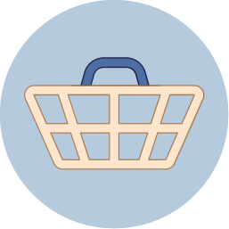
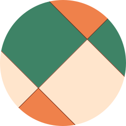
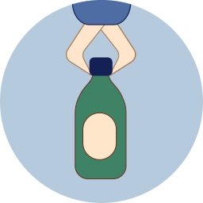
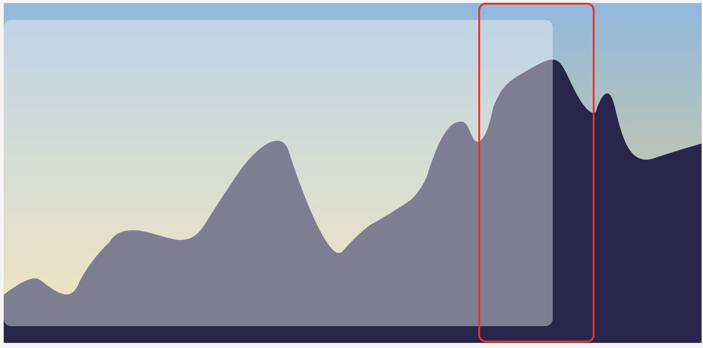
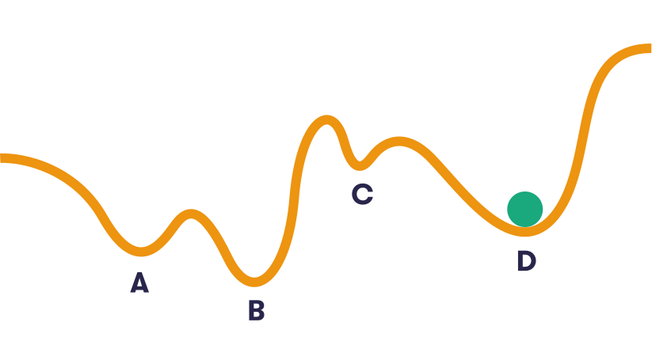
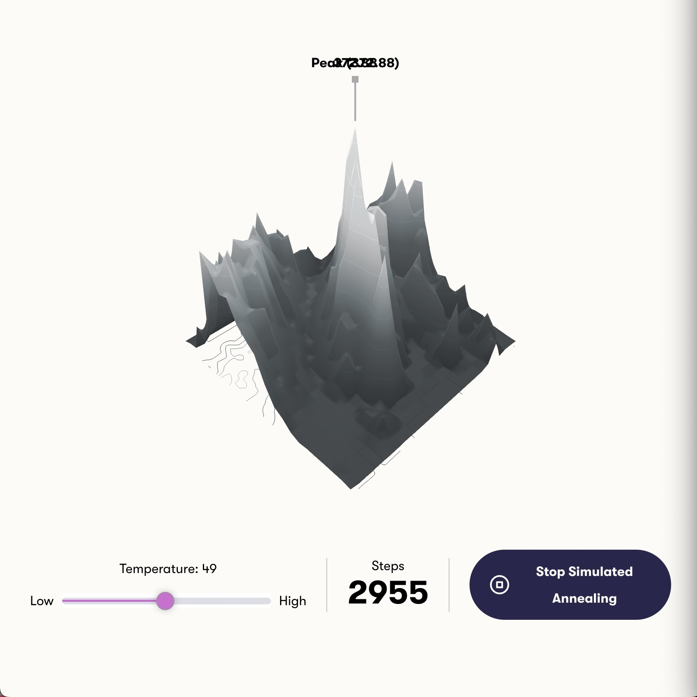
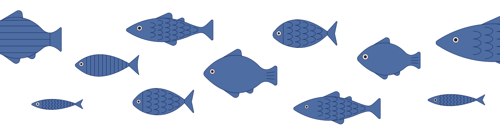
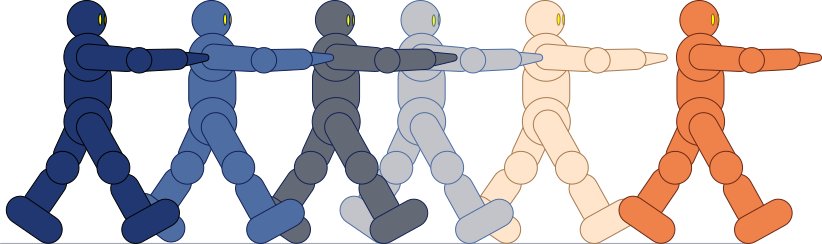
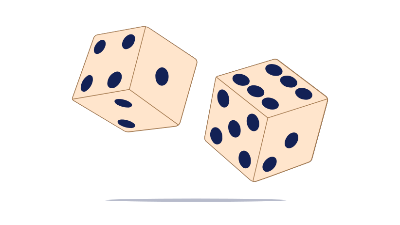

# Table of contents
## [chapter01: getting started with ai](#chapter01-getting-started-with-ai)

[I. why ai matters](#i-why-ai-matters)
<br>[II. optimization](#ii-optimization)
<br>[III. hill climbing](#iii-hill-climbing)

## [chapter02: dealing with uncertainty](#chapter02-dealing-with-uncertainty)

[I. probability fundamentals](#i-probability-fundamentals)
<br>[II. the Bayes Rule](#ii-the-bayes-rule)
<br>[III. Naive Bayes classifer](#iii-naive-bayes-classifier)

## [chapter03: machine learning](#chapter03-machine-learning)

[I. odds and probability](#i-linear-regression)
<br>[II. the bayes rule](#ii-the-nearest-neighbor-method)
<br>[III. naive bayes rule](#iii-working-with-text)
<br>[IV. overfitting](#iv-overfitting)

## [chapter04: neural networks](#chapter04-neural-networks)

[I. Logistic Regression](#i-logistic-regression)
<br>[II. From Logistic Regression to Neural Networks](#ii-from-logistic-regression-to-neural-networks)
<br>[III. Deep Learning](#iii-deep-learning)

## [chapter05: conclusions](#chapter05-conclusions)

[I. summary](#i-summary)
<br>[II. Your AI idea](#ii-your-ai-idea)
<br>[III. AI idea gallery](#iii-ai-idea-gallery)


# Chapter01: Getting started with AI

## I. Why AI matters

<h3>In this course, we're going to take you on a journey towards your first implementable AI idea and give you the tools to make it a reality. The path begins by looking into the algorithms that make artificial intelligence methods possible. But before we start, we wanted to take a brief moment to discuss why AI matters in the first place.</h3>

In a word, relevance. Artificial intelligence, or at leas "narrow AI" (AI that handles only one task), is already a part of our dailly lives. When we search online, use our smartphone to take and edit a picture, ask Siri or Alexa for a recommendation, or use GPS navigation, we're relying on AI methods. In practice this means we're already surrounded by AI, and this influence only looks set to grow.

As you will find in this course, we think this influence is a good thing - so lon as we're smart about it. After all, AI is simply a collection of methods for solving problems. We think that AI is too important to leace just to tech experts. That's why our goal is to empower as many people as possible to be part og creating meaningful AI solutions to real-world problems. Building AI is for anyone who wants to improve their AI-related vocabulary and skills, including non-programmers and people who can program in Python. By taking the course, you'll learn more about what makes different AI methods possible and where and how these methods can be applied in real life - helping you to communicate about AI and take part in AI-related projects. 

For some of you, this course will also be the first step towards actually being able to program these methods. From here, you'll be able to go to more advanced courses that really delve into the programming. By finishing this course, you'll be able to start firmulating a realistic, useful and implementable AI idea - which can become your own project that you develop as far as you want.

### What AI looks like in real life

Here are just a few examples of where you can find AI methods at work. These are all real-life cases that we will look at in more detail in later chapters:

|   |   |
| - | - |
|  | **<h4>Content recommendation</h4>** All of us are familiar with content recommendation systems (think Netflix or YouTube). But as it turns out, commonly used recommendation algorithms are good for example at recommending popular shows (like drama) while downplaying other areas like educational or scientific content. But this can be changed, increading people's exposure to broader types content. |
|   | **<h4>Online shopping</h4>**  So much choice, so little time. But how do you make browsing tens of thousands of items convenient, expecially on a mobile phone? Machine learning methods can recommend products based on the purchase behavior of an individual user as well as other customers who purchased similar products.|
|   | **<h4>Online support</h4>** Nearly half of social media users have encountered online bullying or harassment online. Machine learning methods based on Natural Language Processing (NLP) can be used to provide scalable legal and psychological first aid online |
|  | **<h4>Resources mapping</h4>** What kind of critical infraestructure (like schools) exists in your country? In a lot of places around the world, the answer is "not sure". But having an accurate and comprehensive map of infraestructure is a key tool for measuring and improving quality. Heuran networks can be trained to identify features from looking at high-resolution satellite images in order to identify buildings and create accurate maps.  |
|  | **<h4>Waste sorting</h4>** Reduce, reuse, recycle - we're all familiar with the mantra, and most of us dutifully sort our waste. But what happens after that? The fact is a lot of what we "recycle" still ends up in a landfill or is incinerated. But using neural networks can enable robots to sort waste and improve recycling rates. |
|  | **<h4>Your AI idea</h4>** For learning purposes, this is probably the most important example of real-life AI in this course, simply because it's yours. The optional project in Chapter 5 is the endpoint of your Elements of AI journey and the final stepping stone after which you'll be able to present your idea to the wider AI community. |

><h3>Working with AI in real life</h3>
>
>People can encounter and use AI in their work in many different ways. Here are three common examples:
>
>- You can work as a professiona who has a good understanding of AI methods and the ability to ideate realistic solutions that involve an AI component. The ability to combine an understanding of AI with knowledge from other fields can lead to valuable results, even if you're not writing the code yourself.
>
>- Those who are more interested in the infrastructure behind what makes AI systems tick can work, for instance, as Data Engineers. A Data Engineer makes sure that data flows where it is neede and is of the right type and quality for specific AI solutions. It's crucial with real-life, large-scale, production-ready AI systems to get the supporting infrastructure right so as to avoid the so called "garbage in, garbage out" problem
>
>- THose who have a dep understanding of AI algorithms can apply this methods to real-life problems with job titles such as AI Developer, AI Engineer, or Data Scientist. To excel in this area, you need to have rpoven track record in applyting AI to defferent types of problems. In addition to the technical skills, you should apply AI in the first place, and when not.
>
>The world seems to be full of people who claim to be AI evangelists but what modern companies are looking for is people who can make things happen and who actually understand what AI is and what it isn't capable of - and that's exactly whar this courtse can help with. [Read Mikko's career story as an example here](https://www.reaktor.com/blog/a-letter-from-your-future-colleague-mikko/)
>
>If you are aiming fot a career in Data Science, you may wish to consider in applying, for instance, to the [University of Helsinki's Master Programme in Data Science](https://www.helsinki.fi/en/admissions/degree-programmes/data-science-masters-programme)

### How this course takes you towards real-life AI solutions

It takes a lot of steps to get to the level where you can actually create AI methods. This courtse exists to help bridge the gap between a total beginner course in AI (like the [Elements of AI: Introduction to AI](https://course.elementsofai.com/)) and more advanced machine learning / AI courses available now.

One of our goals with this course is also to help introduce you to the broader AI community. For the reason, Chapter 5 is an optional project suitable for all the students taking this course, whatever the level. With our final project, we want to encourage you to step out of this sandbox and get your hands dirty with some "reall world" AI programming (even if it's simple) and we'll introduce you to GitHub, the leading code sharing platform where everyone in the AI community comes together to collaborate.

For those of you who don't program, you can still take part by following the template of questions in Chapter 5 to begin outlining a problem that could be potentially solved by AI, and the kind of methods that might work to solve it. We ultimately hope you can share your ideas in your workplace or connect with potential developers and see your idea come to life. We'll also offer a chance to showcase ideas and the projects that grow out of this course in our GitHub gallery.

You'll get the necessary tools to prepare you for submitting and idea by completing this course and the accompanying exercises

## II. Optimization

<h3>You may ask "what do we mean when we talk about AI? Is it something very advanced like deep neural netwotks and complex algorithms, or is it just a fancy word for any software?</h3>

Unfortunately, we can't give a precise definition. WHy? Because there isn't one. THe field of AI doesn't have a commonly agreed definition (we discuss this topic in some detail on [Chapter 1](https://course.elementsofai.com/1/1) of the Introduction to AI course). We argue that it's often the way the technology is being used, rather than the technology itself, that determines whether it is appropriate to call it AI or not.

><h3>A case in point: optimization</h3>
>
>A good example of something that can be AI or not, depending on the use case, is optimization. As you will see, some optimication. As you will see, some optimization algorithms are very, very simple, and can be implemented in a few lines of code. However, we will argue that the outcome may be considered intelligent behavior, which many of us would call AI without qualms.

In an [Introduction to AI](https://course.elementsofai.com/2) (Chapter 2), we showed how various "brain teasers" or puzzles, like the towers of Hanoi or the Chicken Crossing Puzzle, can be formulated as search problems and solved in a straightforward manner by finding a path from the starting point to the goal.

When we have the superpower for programming, we can scale this up to much bigger problems than before when we have to solve everything with a pencil and paper. We will start with an absolute classic, the so-called Traveling Salesperson Problem (or TSP, for those who love [TLAs](https://en.wikipedia.org/wiki/Three-letter_acronym))

><h3>An example optimization task</h3>
>
>Imagine that you've been assigned the task to plan the route of a container ship loaded with pineapples. The ship starts in Panama, loaded with delicious Fairtrade pineapples. THere are four other ports, New York, Casablanca, Amsterdam, and Helsinki, where pineapple-craving citizens are eagerly wating. The ship must visit wach of the four destination ports exactly once, but the order in which wach part is visited is free. The goal is to minimize the carbon emissions, which means that a shorter route is better than a longer one.


To solve this problem, it is wnoguh to list all the possible routes that start from Panama and visit wach other ports wxactly once, calculate the carbon emissions of each route, and printo ut the one with the least emissions.

Let's consinder each stage separately, starting from listing all the possible alternatives. The term used by programmers is enumerate. So we'll first **enumerate** all the possible routes. THose of you who are well-versed in combinatorics (the part of mathematics that deals with combinations of finite sets of objects) will know that the number of routes is `4 * 3 * 2 * 1 = 24`. 

### exercise01: listing pineapple routes

How many routes would there be if all the people in Helsinki were allergic to pineapple? In other words, what is the number of routes from a given starting point to three other ports (instead of four)? 

6 -> Correct. The formula for counting the number of routes is 1 x 2 x 3 x ... where the last number is the number of ports, not including the starting points. So if there are three other ports, the number is 1 x 2 x 3 = 6.

### What this teaches us

Just listing the alternatives is not very useful byt at least it helps us realize that the number of routes starting to be so high that finding the best one manually would be a chore. There are 24 routes for five ports (one of which is the starting point). If some pineapples were also wanted in, say, London, if could be added in the route in five different positions so the number would become `5 * 24 = 120`. With yet another destination, whis number would be multiplied by 6, to get `6 * 120 = 720`.

>The formula `1 * 2 * 3 * ... * n` is called a *factorial* and it gores **really** fast. For 10 destinations (in addition to the starting point in Panama), the number of routes is already 3,628,800. This means that very quickly a manual solution is completely out of the question.

An automatic solution using a computer can take us much further. However, without some clever strategies to reduce the workload, eeven a computer will choke sooner or later. Which is where more advanced AI techniques step in. But let's not rush ahead of ourselves before we have to - let's work out our route to get the pineapples delivered to the four cities with minimal carbon emissions.

Having listed the alternatives, next we can calculate the carbon emissions for each of them. Below you will find the distances between portis in kilometers in a five-by-five table.

|	 |PAN | AMS| CAS | NY | HEL |
| - | - | - | - | - | - |
| PAN | 0| 8943 | 8019 | 3652 | 10545 | 
| AMS |8943 | 0 | 2619 | 6317 | 2078 |
| CAS | 8019 | 2619 | 0 | 5836 | 4939 |
| NY | 3652 | 6317 | 5836 | 0 | 7825 |
| HEL | 10545 | 2078 | 4939 | 7825 | 0 |

Let's assume that the boat is realtively modern and produces 0.020 kg of CO2 emissions per kilometer for the amount of pineapples that we are shippong. Thus, you can calculate the emissions caused by traveling from Panama to Amsterdam by first looking up the distance in the first row, second column of the table (highlighted in the above table): 8943 km, and then multiplying this with 0.020kg/km to get 178.9 kg.

### ecercise02: pineapple route emissions

Using the reference table, calculate the emissions produced by the following three routes. Which produces the least emissions?

>- PAN, AMS, CAS, NY, HEL -> 623.18
>
>- PAN, NY, CAS, AMS, HEL -> 283.7 -> less emisions
>
>- PAN, NY, AMS, CAS, HEL -> 350.7
>
>correct! The total distances are 25,223.0 km, 14,185.0 km, and 17,527.0 km. The corresponding emissions are 504.5 kg, 283.7 kg, and 350.5 kg, respectively. So the second route is the shortest and produces the least emissions. If you look at the map, the second route makes sense since it starts from Central America, stops at North America, crosses the Atlantic to stop at the African continent before continuing to Central Europe and finally to Northern Europe.

In all of the abov exercises, we had a criterion or score that ranks different alternatives so that we can always decide which is the better choice. For example, in the pineapple shipping problem, the total length of the route or the amount of carbon emissions was the criterion and we always preferred the shoreter route with the lowest emissions.

The above exercises are meant to show if we can only devise such a criterion, then the problem-solving task becomes a straightforward optimization tasl. This is not to say that it would necessarily be an easy task since the number of alternatives can be really, really big. The approach that we used, where we simply iterate through every single option and choose the best, is called the **brute force** approach.

><h4>When brute force is not enough</h4>
>
>Saying that computers are fast is an understatement. Modern processors instructions ar rates measured in gigaterz (GHz) - that is, billions of instructions per second. So we can do a lot by using a brute force approach that simply iterates through all the possible solutions. However, many of the problems we are solving are such that even the fastest computer chokes due to a phenomenon called combinatorial explosion. For any such problem, the brute force approach is too slow unless the problem size (such as the number of ports) is very small. This may mean that we have to settle for a good solution instead of the optimal one.

## III. Hill climbing

<h3>In the previous section, we learned how to do optimization by simply going through all the possible solutions and picking the best out of them. We mentioned that this simple 'brute-force' approach may become infeasable when the number of alternatives grows astronomically large. Going further requieres smarter techniques. One of them is called hill climbing.</h3>

The basic idea can be illustrated by the following analogy. Imagine you're wandering in the Nordic forests and enjoying the cleand and wild nature. However, you may want to make a phone call to your friend to let them know you're ok - or perhaps you feel the need to share a beautiful photo on Instagram to get a few new folowwers. In the wild, cell phone coverage can sometimes be limited, so you look for a hilltop where the reception is better. In between the trees, you can't quite see where the highest nearest hill is, but you can always try to walk uphill from where you are, and hope that as long as you keep going up, you'll find a good spot. 

><h4>The hill climning method</h4>
>
>The above strategy amounts to what is called the hill climbing method. In optimization terms, your current location would be a specific solution, and the current elevation (measured in meters from the sea level, for example) would be the value of the optimization criterion. The different directions in the forest would correspond to small changes in the current solution.

Obviously, you may not find the highest hilltop, and if you follow this strategy very strictly and allow yourself to only go up, you may well end up on a small bump instead of an actual hill at all. The same goes for the hill climbing technique in optimization: it doesn't guarantee that you find the absolute best solution, just a solution that can't be improved with a small change. THe starting point makes all the difference: if you are fortunate enough to start near the highest peak, you'll probably find it.

To better understand the idea, we'll start by considering a simple scenario involving actual hill climbing. Our fearless hero, the mountaineer Venla Gustafsson, is determined to conquer another mountain. Unfortunately, she has forgotten to take her eyeglasses with her and she can only see as far as her arm can reach. So she just climbs upwards and once she reaches a summit, she stops. Let's see what happens.


You should be able to see taht Venla will reach the nearby summit marked by 'x', which is however, not the highest summit of the mountain. Venla is disappointed but not disheartened. She asks you to take her to a point on the mountain from where she can reach the highest summit by only going upwards.

### exercise03: reach the highest summit

Adjust the slider to mark the region that will ensure that Venla reaches the highest summit. Venla will start at a random position inside the region and climb up to the highest peak there. 

Note: You should drag and resize the slider in order to select the correct answer.



    The answer is not correct -> Because Venla can only travel upwards (going either left or right), we need to set the boundaries of the zone just above the lowest points on either side of the highest peak.

One problem with the hill climbing method is that we can easily get stuck in a good but not optimal solution. These are called 'local optima' (note: thie plurar form of optimum is optima), whereas the absolute best solution is called the 'global minimum'. (Sometimes there may be several equally good, best solutions, in which case, we should also say global optima).

><h4>Greedy solutions</h4>
>
>The simple hill climbing solution where we only go upwards is often said to be a greedy method: it greedily optimizes the short term gain and refuses to incur some temporary loss even if it would lead to bette long-term gain.

Many solutions have been devised to get around this issue. And we really mean, many solutions - hundred of solutions- The field of optimization has become somewhat of a zoo where exotic algorithms roam wild: ant colony algorithms, genetic algorithms, simulated annealing, tabu search, and cuckoo search (we kid you not), just to give a few examples.

><h4>Simulated annealing</h4>
>
>One of the simplest and most effective solutions is simulated annealing. It was invented by Scott Kirkpatrick, Daniel Gelatt, and Mario P. Vecchi in 1983 taking inspiration from metallurgy, where cooling a metal object slowly allows its crystal structure to find a minimum energy configuration. THe method is remarkably simple. Instead of only allowing changes that improve the solution (go uphill), some changes that improve the solution (go uphill), some changes that make it worse (go downhill) are also allowed with some probability. The probability of allowing a downwards transition it goes and a so called 'temperature'. The higher the temperature, the higher the probability of allowing a downhill move. The idea is to start at a high temperature so that the changes are more or less random, but to gradually decrease the temperature so that eventually, the probability of going downwards becomes vanishing small.

Let's practice using randomness in Python because we'll need it to implement simulated annealing. The following program prints out the word `dog` with 20% probability.

    import random
    prob = 0.20

    if random.random() < prob:
        print('dog')

Why does it print `dog` with 20% probability? The idea is to draw a random value between 0.0 and 1.0 - that's what the function random() in module random does - and to check whether it is less than the required probability value expressed as a decimal number. FOr examle, the probability that the random value falls between 0.5 and 1.0 is 50%. The probability that the value falls also between 0.0 and 0.5 is 50%. The probability that it falls between 0.0 and 0.2 is 20%, and so forth.

Instead of "with 20% probability" we could have said "with probability 0.2". We also tend to use expressions like "in one of five cases" or "tewo out of ten cases". All those mean the same thin. Note that "two in ten cases" doesn't necessarily mean that something will occur in exactly two cases in ten repetitions. Rather, it simply means that in the long run, the frequencu will be two out of ten, which is one way to define probability.

### exercise04: probabilities

We will use probability to make our optimization techniques better by helping them escape local optima. COnsider the following small-scale example. The goal is to have a ball land at the lowest point. marked by B below, on a bumpy surface.



Note that here lower is better, so we are doing the exact opposite of the hill climbing example where the goal was to go up-

The ball is initially in point D, which is a local optimum. Suppose the you can shake the surface to make the ball bounce around. If you shake the surface gently, the ball will be unlikely to escape its initial position D. If you give the surface a single very strong jerk, the ball will bounce randomly and then roll down the hill to a local optimum which may or may not be the global optimum B.

Which of the following shaking strategies you think will most likely succeed in having the ball land at the lowest point B after you stop?

    shaling first strongly and then gradually more gently -> correct! Shaking the surface first strongly and then gradually more gently will most likely succeed. If you start by shaking the surface gently, the ball will unlikely escape the local optimum D. On the other hand, if you shake the surface strongly at the end, the ball will bounce to a random position and the roll down to a local optimum. Starting with strong shaking will first have the ball bouncing randomly but then as you reduce the strength, the lower the position of the ball, the more unlikely it is to bounce over the high "barriers" around the local optima.

The idea to simulated annealing is similar to greedy search in that the optimization proceeds iteratively, gradually moving towards better (higher scoting) solutions. The crucial difference is that in simulated annealing, a new solution may sometimes be accepted even if has lower score than the current solution. This is done by introducing randomness in the acceptance rule: a new solution that has lower score than the current one is accepted with a probability that depends on the difference between the new and the current scores.

><h3>Simulated Annealing: the math</h3>
>
>The more math inclined among you may take pleasure in the mathematical details, but even if you don't, the following is doable if you just think of it as a recipe for turning a few numbers into decisions. THe probability of accepting the new solution with score *Snew* when the current solution has score *Sold* is given by the formula:
> 
>$prob = exp ( – ( Sold ​– Snew​ )÷ T )$
>
>where $T$ is the temperature (remember that the temperature is an abstract concept that ideally starts high and gradually decreases towards zero). The function $exp(x)$ is the exponent function which can also be written mathematically as $e^x$ (the so called Euler's constant $e$ = 2.7128 raised to the power $x$). In Python, the function is found for example in the library `numpy` so you'll have to write `import numpy as np` in your code and refer to the function as `np.exp`. 

### exercise05: warm-up temperature

Let's work with the acceptance probabbility above $exp(-(S_old - S_new) / T)$.

Note: dont' worry about the math, your computer can do the actual calculation - you'll just need t o fill the right numbers.

Suppose our system has a current "score" where $S_old$ has the value of 205 (for ecample, our score could be height in meters if we are literally talking about hill climbing example). The score we want $(S_new)$ should have a value of 196. We have set our temperature T at 5.

Using simulated annealing, there is a possibility for us to accept this new score even if it is not immediately higher in score than the current score.

In this situation, what's the probability we will choose the new score?

Hint: You can calculate these formulas using most web browsers by typing equations in the search bar.

    0.17 -> Correct! You can calculate these formulas using most web browsers by typing the equations in the search bar. So for example, to calculate the acceptance probability when S_old = 205 and S_new = 196, and temperature T=5, you can just copy-paste the text exp(-(205-196)/5) into your browser to get the result that is about 0.16529.You can calculate these formulas using most web browsers by typing the equations in the search bar. So for example, to calculate the acceptance probability when S_old = 154 and S_new = 149, and temperature T=5, you can just copy-paste the text exp(-(154-149)/5) into your browser to get the result that is about 0.3679.

Let's see how this all works in practice. Below is a small widget that you can play with. It shows a randomly generated landscape with multiple local optima (smaller peaks). THe highest peak is marked with a purple flag. The current solution is marked by a white flag. THe height or score of the highest peak and the current solution are also displayed as numbers.

When you clicked the "Start simulated annealing" button at the bottom, the current solution starts moving about. On each step, a new proposed solution is chosen randomly somewhere near the current solution, and it is either accepted or rejected according to the simulated annealing rule. The temperature that determines how often moves are accepted that take the current solution down the hill can be adjusted by using the slider just below the map.

GO ahead and try the widget. When you set the temperature very hich, the search should became just a random walk, wandering around with no aim to go either higher or lower. When you set the temperature to zero, the search should shoot straight up towards a nearby local optimum. Neither seems to take you to the highest peak except perhaps with a fair amount of luck. If you like, you can try and see what strategies help you get to the highest peak: should you start with a low temperature and gradually increase it, or the other way around?



### exercise06: simulate annealing

To understood what role temperature plays, it's worthwhile to pause here for a second to think about and answer the following questions:

**What happens when we increase the temperature value to a ricidulously  large number?**

    we accept all new solutions.

**What happens if we set the temperature as close as possible to 0?**

    we only accept the new solutions when they are better than the current one.

# Chapter02: Dealing with uncertainty

## I. Probability fundamentals

<h4>Many real-world AI applications have to deal with imprecision and uncertainty. When you use your mobile devide to type a message t your friend, your finger will often touch the keys on the screen a little inaccurately.</h4>

Or perhaps you0ve already switched to text to speech: the same applies even more to the audio signal that is captured when you speak. Your voice is never captured exactly the way it was the last time because of changes in backgorund noise, the position of the microphone relative to your mouth, and changes in your own physiological parameters. The data coming from the touch screen or the microphone is imprecise and may contain contradictory elements. The device will therefore not be able to decide with full certainty which key or word you meant: was it an 'A' or an 'S'? Did you say 'cahsew' or 'achoo'?

><h3>The importance of probability</h3>
>
>Probability is probably (see how 'meta' - do you love ir too? Oh, never mind) the nest way to deal with uncertainty. This is why probability is also the solid foundation underlying most of statistics. you may not have thought about it, but to explore the probability, programming is a particularly fun and useful tool. It is quite easy to do simple experimnets involving probability using computer simulation. Yet another reason to learn how to program: it's actually helpful when learning to better understand probability.

WE won't be going any further into probability than the basics, but if you fell that you need to go slow and refresh your memory, we recommend that you look into Chapter 3 of the [Introduction to AI](https://course.elementsofai.com/3). ALtirnatively, or in addition, you may also enjoy [Khan Academy videos on probability](https://youtu.be/xSc4oLA9e8o) (they have a whole series) or *The Art od Statistics: Learning from Data* (see especially Chapter 8) by [David Spiegelhalter](http://www.statslab.cam.ac.uk/~david/), which we found to be very accesible and informative.

Our first exeercise will involve coin flipping. Coin flipping is a classic example of a situation where if we repeat the trial (the coin flip), the subsequent trials are independent (the results of given coinflip don't depend on a previous result) - which means we can multiply the probabilities of the individual events.

### exercise07: flip the coin

When flipping a coin, you have two possible outputs – heads and tails.

What is the probability of getting two consecutive tails when tossing a coin?

    0.5 * 0.5 = 0.25

What is the probability of getting four consecutive heads when tossing a coin?

    0.5 * 0.5 * 0.5 * 0.5 = 0.0625

><h3>The Monte Carlo method</h3>
>
>THe previous coding exercise - feel free to take a look at it even if you prefer the beginner exercises - demonstrates the so-called Monte Carlo method: simulating random data and estimating probabilities by counting occurrences. While simplistic, it is often remarkably useful. Sometiems it is the best way to avoid spending an eternity doing complex math.

Our motivation for discussing probability is not just to understand coin flipping or other games. We'll be using probability for reasoning - to infer one thing from another. This is based on *conditional probability*. COnditional probability is actually a pretty simple concept. We'll give a very brief recap here, but if you feel that you need to go slow and let it sink in, we recommned that you look into Chapter 3 of the [Introduction to AI](https://course.elementsofai.com/3) again. There's a relevant video of [Khan Academy](https://www.khanacademy.org/math/statistics-probability/probability-library/conditional-probability-independence/v/calculating-conditional-probability) as well. 



Let's start with a concrete example. According to recen OECD statistics, there are 2652 professional fishers (though not officially recognized, we're going to use this term as an alternative to fisherman/fisherwoman/fisherperson) employed in the fishing industry in FInland - the most "recent" statistics are from 2013 but this isn't important for the point being made. The total population of Finland in 2013 was 5439000, so fishing employed only about 0.049 percent, or fewer than one in 2000 Finns. Meanwhile, in Norway the number of fishers was 11,611 out of the total population 5080000, which makes about 0.229 percent, about one in 438 Norwegians. The following table contains the digures for all of the Nordiv countries:

| Country |	Population	| Fishers	| Proportion of fishers |
| - | - | - | - |
| Denmark |	5,615,000 |	1,891 |	0.034% |
| Finland	| 5,439,000 |	2,652	| 0.049% |
| Iceland |	324,000 |	3,800  |	1.173% |
| Norway |	5,080,000 |	11,611 |	0.229% |
| Sweden |	9,609,000 |	1,757 |	0.018% |
| TOTAL |	26,067,000 |	21,711 |	0.083% |

This looks quite unsurprising for anyone familiar with the natural resources and traditional structure of the Nordic countries. Denmark, Finland and Sweden are relatively large countries with plenty of forests and a strong agricultural past, whereas Norway and especially Iceland rely more on the bounty of the sea. Hence a higher number of people that work in the fishing industry (both in absolute numbers and even more percentages) live in these two countries.

Returning to the topic of probability, let0s imagine that we could run a lottery where we randomly choose any citizen in the Nordic countries. Since Sweden has a way bigger population than Iceland, it would be more likely that the winner is a Swede rather than an Icelander. The probability of choosing a person in a specific country can be calculated by dividing the population of the country by the total population of the Nordic countries, 26067000.

The probability of the winner being from each country is as follows:

| Country |	Probability of choosing a winner |
| - | - |
| Denmark |	21.5% |
| Finland |	20.9% |
| Iceland |	1.2% |
| Norway |	19.5% |
| Sweden |	36.9% |

These kinds of calculations are something w can very well do without writing math formulas, but in case we wanted to express the above calculations as a formula, it would be:

>$P(country) = population(country) / totalpopulation$

The meaning of this is that $P(country)$ is the probability (hence the letter $P$) that the winner is in a specific country (for example, Denmark), and $population(country)$ is the number of inhabitnats in that country. THe denominator (the thing you divide by) is the total population, in this case 26067000. In the above table, we have converted "raw" numerical values like 0.2154065 to percentages with one decimal place, such as 21.5%.

WHat if we were told that the winner has been chosen and that he or she turns out to be a fisher? The chances of the winner being from a specific country can now be calculated by dividing the number of fishers in the country by the total numfer of fishers in all of the aboce countries, which is 21711. The probabilities of the winner being a citizen of a certain country, given that the winner makes their living in finishing, look quite different from the probabilities of the winner makes their living fishing, look quite different from the probabilities of the winner being a citizen of the same country without specifying whether thwy are a fisher or not:

| Country |	Probability of choosing a winner |
| - | - |
| Denmark	| 8.7% |
| Finland	| 12.2% |
| Iceland |	17.5% |
| Norway |	53.5% |
| Sweden |	8.1% |

These are the conditional probabilities of the winner from each country given that the winner is a fisher. The expression has the form "probability of X given Y" where X and Y are specific events. For example:

> $P(Denmark|fisher) = fishers(Denmark) / fishers(total)$

which equals 0.08709871 - we round this and express it as a percentage: 8.7%.

So to summarize, what the above example demonstrates is the use od conditional probability to update our beliefs about the nationality of the lottery winner. Before learning that the winner is a fisher, the most likely nationality was Swedish, based o nthe fact that Sweden has the largest population among the Nordic countries. After learnign that the winer is a fisher, the most likely nationality is Norwegian.

The benefits of using probability to represent uncertaint carry over to more complex scenarios where may learn multiple pieces of information, like for instance if the winner is male or female, or their age. These would allow us to further refine and update our beliefs about the nationality as well as other properties of the winner.

### example08: fishing in the nordics

What is the probability that the winner is a fisher given that they are Norwegian? Be mindful of the innocent sounding distinction between the probability of X given Y and the probability of Y given X.

    0.229%

## II. The Bayes Rule

<h4>In the previous section, we used conditional probability to make inferences about something we didn't know based on a specific piece of information. To recap, what we didn't know was the nationality of the lottery winner and the piece of information that we made use of was the fact that the winner was a fisher.</h4>

There is a specific way to calculate such conditional probabilities that is particularly useful in many applications, namely the Bayes rule. The often-used formula for the Bayes rule is:

>$P(A|B) = \dfrac{P(B|A)P(A)}{P(B)}$

If we use specific events in place of $A$ and $B$, we got for example:

>$P(Denmark|fisher) = \dfrac{P(fisher|Denmark)P(Denmark)}{P(fisher)}$

$P(Denmark|fisher)$ stands for the probability of a person being Danish, given that they are a fisher. To calculate it, we now need numerical values for the three quantities on the right, namely $P(fisher|Denmark)$, $P(Denmark)$ and $P(fisher)$.

THe first term is the probability that a random person is a fisher given that they live in Denmark. This we calculated in the previous section to be about $0.034\%$. The second term is the probability that a random person lives in Denmark, considering the Nordic countries only at this time, which we also have already calculated and found to be about $21.5\%$.

The third and the last term that we need is the only one that maye sometimes require a bit of work to figure out. Here it is quite straightforward to calculate by adding up the number of fishers in all five countries, which gives $21.711$, and dividing this by the total population of the said countries, $26.067.000$. THis too we have already calculated and it can be found in the first table of the previous section: about $0.083\%$.

For the calculations, we'll write the probabilities as plain decimal numbers instead of percentages (just dive each percentade by 100) so here's the formula with the abobe numbers substitued in the correct places:

>$P(Denmark|fisher) = \dfrac {0.00034 x 0.215}{0.00083} = 0.088$

(rounded to three decimal places) or $8.8\%$. Recall that we already knew the result since we hac calculated without the Bayes rule above. (If you have an eye for details, you may have noticed that the result was $8.7\%$ earlier. THis is caused by rounding errors - had we used a more accurate value for the proportion of fishers in Denmark than $0.00034$, we would have gotten the same result, $8.7\%$. This ilustrates the importance of using a sufficient number of digits especially for small numbers. With computers, it's much easier to maintain high precision since we don't have to actually write down the numbers, although there are cases where floating point rounding errors become problematic as well).

The good news is that we got the right result, but you are probably wondering why on Earth we went to the trouble of using the Bayes rule since there was a direct way to reach the same result? The answer is that we wanted to illustrate the use of the Bayes rule so that we could use it later in other cases. It is often the case that we know three terms on the right side of the Bayes rule but we don't know the terms required on the right side of the Bayes rule but we don't know the term required for the direct calculation. Typical  cases like this include medical diagnosis (see for instance the breast cancer screening example in the [Introduction to AI](https://course.elementsofai.com/3/2)) and other scenarios where we know the probability of the effect (test result) given its cause (a medical condition), but not the other way around.



### exercise09: block or not

Let's suppose you have a social media account on Instagram, Twitter, or some other platform (just in case you don't, it doesn't matter. We'll fill you in with the relevant information). You check your account and notice that you have a new follower – this means that another user has decided to start following you to see things that you post. You don't recognize the person, and their username (or "handle" as it's called) is a little strange: John37330190. You don't want to have creepy bots following you, so you wonder whether to block them. To decide whether you should block the new follower, you decide to use the Bayes rule!

Let's assume that 5% of your new followers are bots: this can be written as

$P(bot) = 0.05.$

Let's also assume that 80% of bot accounts have a username that includes an 8-digit number (like 37330190):

$P(8-digits | bot) = 0.8$

The last term that is required is the probability that a new follower (either a bot or not) has an 8-digit number in their username. Assume this to be:

$P(8-digits) = 0.041.$

Calculate the probability that the new follower is a bot, P(bot | 8-digit), using the Bayes rule: P(A | B) = P(B | A)P(A)/P(B). The values of the three terms that are needed are found above. Choose the right answer (rounded up to one decimal digit):

    $97.5\%$ - probability 0.976

We'll demonstrate another example use case for the Bayes rule in the next section, namely document classification, using the classic example of a spam filter. 

## III. Naive Bayes classifier

One of the most useful applications of the Bayes rule is the so-called Naive Bayes classifier. It is a machine learning technique that can be used to classify objects such as text documents into two or more classes. The classifier is trained by analyzing a set of training data for which the correct classes are given. We cover this in an [Introduction to AI](https://course.elementsofai.com/4/1) and will return to these concepts in this course in [Chapter 04](https://buildingai.elementsofai.com/Neural-Networks). For now, all you need to focus on is that the basic idea is to use the Bayes rule to calculate the probability.

>$P(spam|words)=\dfrac{P(words|spam)P(spam)}{P(words)}$

This is the probability of a message being spam given the words it contains. If this probability is high, then the filter may automatically delete the message or put it into a junk mail folder.

The idea is to use a large collection of spam messages to estimate the frequency of each word in them, which can be used as $P(words|spam)$. The same is done for non-spam messages, which is often called "ham", to estimate $P(words|ham)$. As you may notice, the Bayes rule formula above doesn't really include the latter term, but it is needed to calculate $P(words)$, which refers to the word frequencies in all messages (either ham or spam)

><h3>What do we mean by naive?</h3>
>
>
>
>The reason why the Naive Bayes classifier is called 'naive' has to do with processing each word in the message independently and ignoring their order. So according to the Naive Bayes model, a message with the content 'dog bit man' is not different than 'man bit dog'. This way of ignoring the word order is often called a 'bag of words' approach, and we'll return to this issue later in the course.

Processing the words independently leads to a nice procedure where the Bayes rule is applied repeatedly to update the probability each time a new word is received. THe procedure is explained in the [Introduction to AI](https://course.elementsofai.com/3/3), so we'll just skip to the resulting algoritihm, which is as follows:

1. start with the odds 1 : 1, which means that the probability of spam is 0.5.
2. calculate the so called likelihood ratio as $r = \dfrac{P(word|spam)}{P(word|ham)}$
3. multiply the current odds by $r$.
4. repeat steps 2 and 3 until all words have been processed.

**Note**: we are using odds instead of probabilities here because it simplifies the procedure significantly. THe relationship between odds and probabilities is explained in the [Introduction to AI](https://course.elementsofai.com/3/1).

To give a simple artificial example, suppose the message is just two words: 'million conferences'. We need the frequencies of the words can easily be estimated from a collection of both kinds of messages. Let's suppose the frequencies have been estimated as follows:

| |	spam |	ham |
| - | - | - |
| million	| 0.0016285 |	0.0003198 |
| conferences |	0.0000100 |	0.0000391 |

The ratios calculated in step 2 of the algorithm are then (rounded to four decimal places):

>$\dfrac{P(milion|spam)}{P(million|gam) = \dfrac{0.0016285}{0.0003198}} = 5.0923$

>$\dfrac{P(conferences|spam)}{P(conferences|gam) = \dfrac{0.0000100}{0.0000391}} = 0.2554$

When the odds 1 : 1 is multiplied by the first one, it becomes 5.0923 : 1. This means that given just the world 'million', the probability that the message is spam is about five times as high as the probability that it's ham: the message looks to be spam but may well turn out to be ham after all. With the second word 'conferences', the oods are multiplied by 0.2554 so it becomes $(0.2554 x 5.0923) : 1 = 1.30 : 1$. Now the chances are almost equal that the message is either spam or ham.

Recall that you can get probability values from odds by using the following simple formula:

>$if odds = x : y, then probability = \dfrac{x}{(x+y)}$

For example, the odds $130 : 1$ makes the probability $\dfrac{1.30}{(1.30 + 1)} = 0.565$ (with three decimal places). Or if you think that percentages are nicer, $56.5\%$.

### exercise10: naive bayes classifer

We have two dice in our desk drawer. One is a normal, plain die with six sides. Each of the sides comes up with an equal 1/6 probability. The other one is a loaded die that also has six sides, but that however gives the outcome six on every second try on average. That means the probability that you get a six is 16.7% with the first die but 50% with the second die.

Suppose that we pick one of the dice at random so that both have the same chances of being picked, then start rolling the same die again and again. If the outcome is six on the first roll, you wouldn't be very sure it's the loaded die. If the outcome is also six on the second roll, you'd start thinking it probably is. After the third six, you'd start to be quite convinced.

If the outcome keeps being six, how many rolls would it take altogether (counting from the start) until the odds are at least 100:1 in favor of the loaded die?

Tip: use the likelihood ratio (r) discussed above. In this case, r = P(6 | loaded) / P(6 | normal).

    5 -> The likelihood ratio is r = P(6 | loaded) / P(6 | normal) = (1/2) / (1/6) = 3. If we start with the odds 1:1, the sequence of odds after each roll with the outcome 6 are as follows: 3:1, 9:1, 27:1, 81:1, 243:1, ... The fifth one is the first that is 100:1 or higher, so it takes five rolls with the outcome 6 to reach 100:1.

# Chapter03: Machine Learning

## I. Linear Regression

According to a popular quip taht circulates on Twitter:

- When fundraising: is AI.

- When recruiting: is machine learning.

- When implementing: is linearregression.

In fact, we think that the reason why this not-exactly-killing-you-with-laughter kind of a joke has become so popular is taht there is an element of truth in it. It is only sensible to use a more general term, such as AI, when giving an elevator pitch to a potential investor. It is wise to use a more specific term when recruiting to get experts in the right area, andin most of today's AI business, the subarea of AI that is most relevant is machine learning. And in surprisingly many practical applications of machine learning, linear regression with the right data is an extremely powerful technique.

### The types of machine learning

Before we jump into the tipic of machine learning and linear regressiom we should quickly review the types of machine learning.

#### Supervised learning

In supervised learning you know what the answer is, and you try to generate a model with correct answers. For example: you have aparment price data where you know at which price apartments have been sold and some properties of the apartments, like size in square meters, the number of floors, etc. Your model would use these properties to predict the price of an apartment.

A supervised learning problem can be for example a classification problem (I have photos of dogs, cats and parrots and I want to build a model to detect if the animal in a given picture is a dog, cat or parrot), or a regression problem (I have historical data on my class showing how many hours each student studied for the exam and what grade they got, and I want to model this relationship).

#### Unsupervised learning

In an unsupervised learning setting there is no answer, at lear not one you know of. Your model tries to find structure in your data, or generate representations of your data. FOr example, you have a video streaming service, and you have user data showing what videos your users have watched. You can then use this data to group your videos or users based on their profiles. The key point here is there is no ground truth for these groupings supplied by you. It might be true that there in fact is no ground truth for these groupings supplied by you. It mught be true that there in fact are only three types of viewers in your system, but when your problem is an unsupervised problem, it means you do now know this beforehand.

Another example would be to group your video service streaming users into different clusters based on their behavior to get some insight into your user base: you could try to find different types of profiles that could benefit from different kinds of service.

#### Reinforcement learning

Reinforcement learning is probably the closest to what most people think of (in broad terms) when it comes to artificial intelligence. In reinforcement learning you have "agents" that operate in an inviroment in a way that maximizes som kind of reward. An example of an agent would be software that controls your player character in a famous 2d side scrolling platform game. The reward is defined as the final score when passing a level. The agent is then trying to formulate rules dor its behavior that maximize its score: this might include behavior that seeks to pick up score increasing power ups and avoiding hitting enemies and so on.

A more recen example of a reinforcement learning set up is DeepMind's Alpha Go and its varaitions, which is a reinforcement learnign system that can play the board game Go and has surpassed the ebst human players in skill.

Now with that review out of the way, let's return to linear regression:

><h3>Linear regression</h3>
>
>The idea of linear regression is explained in [Introduction to AI](https://course.elementsofai.com/4/3). We will again assume you know the basic idea already. If not, you can take a look at the material in the Introduction to AI. Here we will only give a condensed refresher.

The general problem for which linear regression is one solution among many, is regression. The task is to predict a numerical value given a set of input values. For example, to predict the price of a mökki (a Finnish cabin) based on different features such as the size in square meters, the distance to the nearest neighbours, the condition (measured on some numerical scale), and so on.

>We will use the term input or feature for the data that are used to obtain the prediction, and we use the term output or response dor the thing to be predicted. For example, the size of the cabin is a feature (or an input), and the price is the output (or the response). Usually, we have some data that contains both te input values as well as the response, and our goal is to adjust the model so that its output matches the actual response values as well as possible.

In linear regression, the prediction is calculated using a linear model where each increment of a feature that is variable by some fized amount increases or decreases the predicted output by the same amount. This amount can be different for each feature. So for example, if the predicted price of a cabin is €400,000, then all other things being equal, each one meter increment in the size will increase the predicted price by the same amount, say, €4000; and therefore, a two square meter increment will increase the price by €8000, a three square meter incremente by €12000, and so on.

The same goes dor the number of indoor toilets, meaning there is a certain amount, say €2000, by which the predicted price increases for each toilet. THe opposite is also true for coefficients which are negative: for example in our case of cabins, the shorter the distance fro mthe cabin to a body of water (say, a lake), the higher the price of the cabin. With a negative coefficient for that variable, each added meter of distance fro mthe cabin to the body of water lowers the price by a fixed amount.

>The cabin price model is a good example of the fact that the linear regression model is not necessarily a very good model. It is clear that the change in the price that comes from being closer to water is likely to be different for cabins of different sizes. THe linear regression model is not able to capture this without special tricks. One such trick would be to change the predicted variable to be the price per square meter. If the price per square meter increases as you get closer to water, the total price of larger cabins would increase than that of small cabins.

The formula used in linear regression in an example case with three variables and three coefficients has the form $c_1 \times x_1 + c_2 \times x_2 + c_3 \times x_3$, where are three coefficients $c_1$, $c_2$, and $c_3$ that corresponds to the three input $x_1$, $x_2$, and $x_3$. The increase in the prediction resulting from increasing one of the inputs by one unit (for example, one square meter) is given by the corresponding coefficient. The number of inputs doesn't have to be three, of course, but the number of coefficients is always the same as tbe number of inputs. Often we include a so-called intercept term in the model too, in which case it becomes like this:

>$a_1 + c_1 \times x_1 + c_2 \times x_2 + c_3 \times x_3$

where "a" is the intercept term.

THe purpose of the intercept term is to make it possible to increment (or reduce if the intercept value is negative) the predicted values by a constant amount independently of the inputs.

Below you will find a simple program that produces predictions about cabin prices. (Disclaimer: The program is meant for demonstration purposes only. Don't blame us if you lose money trusting it's predictions!) You can modify the input values to get predictions for different cabins.

The cabin details, namely size ($66 m^2$), size of the sauna ($5 m^2$), distance to water ($15 m$), number of indoor toilets (2) and the proximity of the nearest neighbour ($500 m$), are specified as the elements of the list $x$. The corresponding coefficients are specified in the list $c$. The elements of the list $x$ are the inputss $x_1$, ..., $x_5$, while the elements of $c$ are the coefficients $c_1$, ..., $c_5$. Note that in the example we don't use the intercept item.

``` python
# input values for one mökkis: size, size of sauna, distance to water, number of indoor bathrooms, 
# proximity of neighbours

x = [66, 5, 15, 2, 500]
c = [3000, 200 , -50, 5000, 100]     # coefficient values

prediction = c[0]*x[0] + c[1]*x[1] + c[2]*x[2] + c[3]*x[3] + c[4]*x[4]

print(prediction)
```

```
258250
```

As you see, the predicted price is $€258,250$. Fell free to play around with the code. You won't break anything and you can always reset the code to its original state to start again.

### exercise11: real estate price predictions
``` python
# input values for one mökkis: size, size of sauna, distance to water, number of indoor bathrooms, 
# proximity of neighbours

x = [66, 5, 15, 2, 500]
c = [3000, 200 , -50, 5000, 100]     # coefficient values

prediction = c[0]*x[0] + c[1]*x[1] + c[2]*x[2] + c[3]*x[3] + c[4]*x[4]

print(prediction)
```

You can use the above piece of code to calculate these, or use pen and paper.

What would the predicted price of a cabin be with the following details? Size: 85 m2, size of the sauna: 10m2, distance to a lake: 15m, number of indoor toilets: 1, distance to next door neighbor: 100m

    271250 €

What would the predicted price of a cabin be with the following details? Size: 155m2, size of the sauna: 15m2, distance to a lake: 5m, number of indoor toilets: 1, distance to next door neighbor: 200m.

    492750 €

Which increases the price of a cabin more? 

    Being 10 m closer to a lake and having an extra indoor toilet changes the price by –50 × (–10) + 1 × 5000 = 5500 eur, while being 10 m² larger and having a neighbour 100 m further away changes the price by 10 × 3000 + 100 × 100 = 40000 eur.

## II. The nearest neighbor method

## III. Working with text

## IV. Overfitting

# Chapter04: Neural networks

## I. Logistic regression

## II. From logistic regression to neural networks

## III. Deep Learning

# Chapter05: Conclusions

## I. Summary

## II. Your AI Idea

## III. AI idea gallery