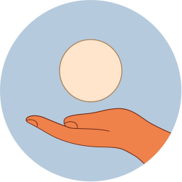

# Table of contents
## [chapter01: getting started with ai](#chapter01-getting-started-with-ai)

[I. why ai matters](#i-why-ai-matters)
 [II. optimization](#ii-optimization)
 [III. hill climbing](#iii-hill-climbing)

## [chapter02: dealing with uncertainty](#chapter02-dealing-with-uncertainty)

[I. probability fundamentals](#i-probability-fundamentals)
 [II. the Bayes Rule](#ii-the-bayes-rule)
 [III. Naive Bayes classifer](#iii-naive-bayes-classifier)

## [chapter03: machine learning](#chapter03-machine-learning)

[I. odds and probability](#i-linear-regression)
 [II. the bayes rule](#ii-the-nearest-neighbor-method)
 [III. naive bayes rule](#iii-working-with-text)
 [IV. overfitting](#iv-overfitting)

## [chapter04: neural networks](#chapter04-neural-networks)

[I. Logistic Regression](#i-logistic-regression)
 [II. From Logistic Regression to Neural Networks](#ii-from-logistic-regression-to-neural-networks)
 [III. Deep Learning](#iii-deep-learning)

## [chapter05: conclusions](#chapter05-conclusions)

[I. summary](#i-summary)
 [II. Your AI idea](#ii-your-ai-idea)
 [III. AI idea gallery](#iii-ai-idea-gallery)

# Chapter01: Getting started with AI

## I. Why AI matters

<h3>In this course, we're going to take you on a journey towards your first implementable AI idea and give you the tools to make it a reality. The path begins by looking into the algorithms that make artificial intelligence methods possible. But before we start, we wanted to take a brief moment to discuss why AI matters in the first place.</h3>

In a word, relevance. Artificial intelligence, or at leas "narrow AI" (AI that handles only one task), is already a part of our dailly lives. When we search online, use our smartphone to take and edit a picture, ask Siri or Alexa for a recommendation, or use GPS navigation, we're relying on AI methods. In practice this means we're already surrounded by AI, and this influence only looks set to grow.

As you will find in this course, we think this influence is a good thing - so lon as we're smart about it. After all, AI is simply a collection of methods for solving problems. We think that AI is too important to leace just to tech experts. That's why our goal is to empower as many people as possible to be part og creating meaningful AI solutions to real-world problems. Building AI is for anyone who wants to improve their AI-related vocabulary and skills, including non-programmers and people who can program in Python. By taking the course, you'll learn more about what makes different AI methods possible and where and how these methods can be applied in real life - helping you to communicate about AI and take part in AI-related projects. 

For some of you, this course will also be the first step towards actually being able to program these methods. From here, you'll be able to go to more advanced courses that really delve into the programming. By finishing this course, you'll be able to start firmulating a realistic, useful and implementable AI idea - which can become your own project that you develop as far as you want.

### What AI looks like in real life

Here are just a few examples of where you can find AI methods at work. These are all real-life cases that we will look at in more detail in later chapters:

|   |   |
| - | - |
|  | **<h4>Content recommendation</h4>** All of us are familiar with content recommendation systems (think Netflix or YouTube). But as it turns out, commonly used recommendation algorithms are good for example at recommending popular shows (like drama) while downplaying other areas like educational or scientific content. But this can be changed, increading people's exposure to broader types content. |
|   | **<h4>Online shopping</h4>**  So much choice, so little time. But how do you make browsing tens of thousands of items convenient, expecially on a mobile phone? Machine learning methods can recommend products based on the purchase behavior of an individual user as well as other customers who purchased similar products.|
|   | **<h4>Online support</h4>** Nearly half of social media users have encountered online bullying or harassment online. Machine learning methods based on Natural Language Processing (NLP) can be used to provide scalable legal and psychological first aid online |
|  | **<h4>Resources mapping</h4>** What kind of critical infraestructure (like schools) exists in your country? In a lot of places around the world, the answer is "not sure". But having an accurate and comprehensive map of infraestructure is a key tool for measuring and improving quality. Heuran networks can be trained to identify features from looking at high-resolution satellite images in order to identify buildings and create accurate maps.  |
|  | **<h4>Waste sorting</h4>** Reduce, reuse, recycle - we're all familiar with the mantra, and most of us dutifully sort our waste. But what happens after that? The fact is a lot of what we "recycle" still ends up in a landfill or is incinerated. But using neural networks can enable robots to sort waste and improve recycling rates. |
|  | **<h4>Your AI idea</h4>** For learning purposes, this is probably the most important example of real-life AI in this course, simply because it's yours. The optional project in Chapter 5 is the endpoint of your Elements of AI journey and the final stepping stone after which you'll be able to present your idea to the wider AI community. |

><h3>Working with AI in real life</h3>
>
>People can encounter and use AI in their work in many different ways. Here are three common examples:
>
>- You can work as a professiona who has a good understanding of AI methods and the ability to ideate realistic solutions that involve an AI component. The ability to combine an understanding of AI with knowledge from other fields can lead to valuable results, even if you're not writing the code yourself.
>
>- Those who are more interested in the infrastructure behind what makes AI systems tick can work, for instance, as Data Engineers. A Data Engineer makes sure that data flows where it is neede and is of the right type and quality for specific AI solutions. It's crucial with real-life, large-scale, production-ready AI systems to get the supporting infrastructure right so as to avoid the so called "garbage in, garbage out" problem
>
>- THose who have a dep understanding of AI algorithms can apply this methods to real-life problems with job titles such as AI Developer, AI Engineer, or Data Scientist. To excel in this area, you need to have rpoven track record in applyting AI to defferent types of problems. In addition to the technical skills, you should apply AI in the first place, and when not.
>
>The world seems to be full of people who claim to be AI evangelists but what modern companies are looking for is people who can make things happen and who actually understand what AI is and what it isn't capable of - and that's exactly whar this courtse can help with. [Read Mikko's career story as an example here](https://www.reaktor.com/blog/a-letter-from-your-future-colleague-mikko/)
>
>If you are aiming fot a career in Data Science, you may wish to consider in applying, for instance, to the [University of Helsinki's Master Programme in Data Science](https://www.helsinki.fi/en/admissions/degree-programmes/data-science-masters-programme)

### How this course takes you towards real-life AI solutions

It takes a lot of steps to get to the level where you can actually create AI methods. This courtse exists to help bridge the gap between a total beginner course in AI (like the [Elements of AI: Introduction to AI](https://course.elementsofai.com/)) and more advanced machine learning / AI courses available now.

One of our goals with this course is also to help introduce you to the broader AI community. For the reason, Chapter 5 is an optional project suitable for all the students taking this course, whatever the level. With our final project, we want to encourage you to step out of this sandbox and get your hands dirty with some "reall world" AI programming (even if it's simple) and we'll introduce you to GitHub, the leading code sharing platform where everyone in the AI community comes together to collaborate.

For those of you who don't program, you can still take part by following the template of questions in Chapter 5 to begin outlining a problem that could be potentially solved by AI, and the kind of methods that might work to solve it. We ultimately hope you can share your ideas in your workplace or connect with potential developers and see your idea come to life. We'll also offer a chance to showcase ideas and the projects that grow out of this course in our GitHub gallery.

You'll get the necessary tools to prepare you for submitting and idea by completing this course and the accompanying exercises

## II. Optimization

<h3>You may ask "what do we mean when we talk about AI? Is it something very advanced like deep neural netwotks and complex algorithms, or is it just a fancy word for any software?</h3>

Unfortunately, we can't give a precise definition. WHy? Because there isn't one. THe field of AI doesn't have a commonly agreed definition (we discuss this topic in some detail on [Chapter 1](https://course.elementsofai.com/1/1) of the Introduction to AI course). We argue that it's often the way the technology is being used, rather than the technology itself, that determines whether it is appropriate to call it AI or not.

><h3>A case in point: optimization</h3>
>
>A good example of something that can be AI or not, depending on the use case, is optimization. As you will see, some optimication. As you will see, some optimization algorithms are very, very simple, and can be implemented in a few lines of code. However, we will argue that the outcome may be considered intelligent behavior, which many of us would call AI without qualms.

In an [Introduction to AI](https://course.elementsofai.com/2) (Chapter 2), we showed how various "brain teasers" or puzzles, like the towers of Hanoi or the Chicken Crossing Puzzle, can be formulated as search problems and solved in a straightforward manner by finding a path from the starting point to the goal.

When we have the superpower for programming, we can scale this up to much bigger problems than before when we have to solve everything with a pencil and paper. We will start with an absolute classic, the so-called Traveling Salesperson Problem (or TSP, for those who love [TLAs](https://en.wikipedia.org/wiki/Three-letter_acronym))

><h3>An example optimization task</h3>
>
>Imagine that you've been assigned the task to plan the route of a container ship loaded with pineapples. The ship starts in Panama, loaded with delicious Fairtrade pineapples. THere are four other ports, New York, Casablanca, Amsterdam, and Helsinki, where pineapple-craving citizens are eagerly wating. The ship must visit wach of the four destination ports exactly once, but the order in which wach part is visited is free. The goal is to minimize the carbon emissions, which means that a shorter route is better than a longer one.

To solve this problem, it is wnoguh to list all the possible routes that start from Panama and visit wach other ports wxactly once, calculate the carbon emissions of each route, and printo ut the one with the least emissions.

Let's consinder each stage separately, starting from listing all the possible alternatives. The term used by programmers is enumerate. So we'll first **enumerate** all the possible routes. THose of you who are well-versed in combinatorics (the part of mathematics that deals with combinations of finite sets of objects) will know that the number of routes is `4 * 3 * 2 * 1 = 24`. 

### exercise01: listing pineapple routes

How many routes would there be if all the people in Helsinki were allergic to pineapple? In other words, what is the number of routes from a given starting point to three other ports (instead of four)? 

6 -> Correct. The formula for counting the number of routes is 1 x 2 x 3 x ... where the last number is the number of ports, not including the starting points. So if there are three other ports, the number is 1 x 2 x 3 = 6.

### What this teaches us

Just listing the alternatives is not very useful byt at least it helps us realize that the number of routes starting to be so high that finding the best one manually would be a chore. There are 24 routes for five ports (one of which is the starting point). If some pineapples were also wanted in, say, London, if could be added in the route in five different positions so the number would become `5 * 24 = 120`. With yet another destination, whis number would be multiplied by 6, to get `6 * 120 = 720`.

>The formula `1 * 2 * 3 * ... * n` is called a *factorial* and it gores **really** fast. For 10 destinations (in addition to the starting point in Panama), the number of routes is already 3,628,800. This means that very quickly a manual solution is completely out of the question.

An automatic solution using a computer can take us much further. However, without some clever strategies to reduce the workload, eeven a computer will choke sooner or later. Which is where more advanced AI techniques step in. But let's not rush ahead of ourselves before we have to - let's work out our route to get the pineapples delivered to the four cities with minimal carbon emissions.

Having listed the alternatives, next we can calculate the carbon emissions for each of them. Below you will find the distances between portis in kilometers in a five-by-five table.

|	 |PAN | AMS| CAS | NY | HEL |
| - | - | - | - | - | - |
| PAN | 0| 8943 | 8019 | 3652 | 10545 | 
| AMS |8943 | 0 | 2619 | 6317 | 2078 |
| CAS | 8019 | 2619 | 0 | 5836 | 4939 |
| NY | 3652 | 6317 | 5836 | 0 | 7825 |
| HEL | 10545 | 2078 | 4939 | 7825 | 0 |

Let's assume that the boat is realtively modern and produces 0.020 kg of CO2 emissions per kilometer for the amount of pineapples that we are shippong. Thus, you can calculate the emissions caused by traveling from Panama to Amsterdam by first looking up the distance in the first row, second column of the table (highlighted in the above table): 8943 km, and then multiplying this with 0.020kg/km to get 178.9 kg.

### ecercise02: pineapple route emissions

Using the reference table, calculate the emissions produced by the following three routes. Which produces the least emissions?

>- PAN, AMS, CAS, NY, HEL -> 623.18
>
>- PAN, NY, CAS, AMS, HEL -> 283.7 -> less emisions
>
>- PAN, NY, AMS, CAS, HEL -> 350.7
>
>correct! The total distances are 25,223.0 km, 14,185.0 km, and 17,527.0 km. The corresponding emissions are 504.5 kg, 283.7 kg, and 350.5 kg, respectively. So the second route is the shortest and produces the least emissions. If you look at the map, the second route makes sense since it starts from Central America, stops at North America, crosses the Atlantic to stop at the African continent before continuing to Central Europe and finally to Northern Europe.

In all of the abov exercises, we had a criterion or score that ranks different alternatives so that we can always decide which is the better choice. For example, in the pineapple shipping problem, the total length of the route or the amount of carbon emissions was the criterion and we always preferred the shoreter route with the lowest emissions.

The above exercises are meant to show if we can only devise such a criterion, then the problem-solving task becomes a straightforward optimization tasl. This is not to say that it would necessarily be an easy task since the number of alternatives can be really, really big. The approach that we used, where we simply iterate through every single option and choose the best, is called the **brute force** approach.

><h4>When brute force is not enough</h4>
>
>Saying that computers are fast is an understatement. Modern processors instructions ar rates measured in gigaterz (GHz) - that is, billions of instructions per second. So we can do a lot by using a brute force approach that simply iterates through all the possible solutions. However, many of the problems we are solving are such that even the fastest computer chokes due to a phenomenon called combinatorial explosion. For any such problem, the brute force approach is too slow unless the problem size (such as the number of ports) is very small. This may mean that we have to settle for a good solution instead of the optimal one.

## III. Hill climbing

<h3>In the previous section, we learned how to do optimization by simply going through all the possible solutions and picking the best out of them. We mentioned that this simple 'brute-force' approach may become infeasable when the number of alternatives grows astronomically large. Going further requieres smarter techniques. One of them is called hill climbing.</h3>

The basic idea can be illustrated by the following analogy. Imagine you're wandering in the Nordic forests and enjoying the cleand and wild nature. However, you may want to make a phone call to your friend to let them know you're ok - or perhaps you feel the need to share a beautiful photo on Instagram to get a few new folowwers. In the wild, cell phone coverage can sometimes be limited, so you look for a hilltop where the reception is better. In between the trees, you can't quite see where the highest nearest hill is, but you can always try to walk uphill from where you are, and hope that as long as you keep going up, you'll find a good spot. 

><h4>The hill climning method</h4>
>
>The above strategy amounts to what is called the hill climbing method. In optimization terms, your current location would be a specific solution, and the current elevation (measured in meters from the sea level, for example) would be the value of the optimization criterion. The different directions in the forest would correspond to small changes in the current solution.

Obviously, you may not find the highest hilltop, and if you follow this strategy very strictly and allow yourself to only go up, you may well end up on a small bump instead of an actual hill at all. The same goes for the hill climbing technique in optimization: it doesn't guarantee that you find the absolute best solution, just a solution that can't be improved with a small change. THe starting point makes all the difference: if you are fortunate enough to start near the highest peak, you'll probably find it.

To better understand the idea, we'll start by considering a simple scenario involving actual hill climbing. Our fearless hero, the mountaineer Venla Gustafsson, is determined to conquer another mountain. Unfortunately, she has forgotten to take her eyeglasses with her and she can only see as far as her arm can reach. So she just climbs upwards and once she reaches a summit, she stops. Let's see what happens.

You should be able to see taht Venla will reach the nearby summit marked by 'x', which is however, not the highest summit of the mountain. Venla is disappointed but not disheartened. She asks you to take her to a point on the mountain from where she can reach the highest summit by only going upwards.

### exercise03: reach the highest summit

Adjust the slider to mark the region that will ensure that Venla reaches the highest summit. Venla will start at a random position inside the region and climb up to the highest peak there. 

Note: You should drag and resize the slider in order to select the correct answer.

    The answer is not correct -> Because Venla can only travel upwards (going either left or right), we need to set the boundaries of the zone just above the lowest points on either side of the highest peak.

One problem with the hill climbing method is that we can easily get stuck in a good but not optimal solution. These are called 'local optima' (note: thie plurar form of optimum is optima), whereas the absolute best solution is called the 'global minimum'. (Sometimes there may be several equally good, best solutions, in which case, we should also say global optima).

><h4>Greedy solutions</h4>
>
>The simple hill climbing solution where we only go upwards is often said to be a greedy method: it greedily optimizes the short term gain and refuses to incur some temporary loss even if it would lead to bette long-term gain.

Many solutions have been devised to get around this issue. And we really mean, many solutions - hundred of solutions- The field of optimization has become somewhat of a zoo where exotic algorithms roam wild: ant colony algorithms, genetic algorithms, simulated annealing, tabu search, and cuckoo search (we kid you not), just to give a few examples.

><h4>Simulated annealing</h4>
>
>One of the simplest and most effective solutions is simulated annealing. It was invented by Scott Kirkpatrick, Daniel Gelatt, and Mario P. Vecchi in 1983 taking inspiration from metallurgy, where cooling a metal object slowly allows its crystal structure to find a minimum energy configuration. THe method is remarkably simple. Instead of only allowing changes that improve the solution (go uphill), some changes that improve the solution (go uphill), some changes that make it worse (go downhill) are also allowed with some probability. The probability of allowing a downwards transition it goes and a so called 'temperature'. The higher the temperature, the higher the probability of allowing a downhill move. The idea is to start at a high temperature so that the changes are more or less random, but to gradually decrease the temperature so that eventually, the probability of going downwards becomes vanishing small.

Let's practice using randomness in Python because we'll need it to implement simulated annealing. The following program prints out the word `dog` with 20% probability.

    import random
    prob = 0.20

    if random.random() < prob:
        print('dog')

Why does it print `dog` with 20% probability? The idea is to draw a random value between 0.0 and 1.0 - that's what the function random() in module random does - and to check whether it is less than the required probability value expressed as a decimal number. FOr examle, the probability that the random value falls between 0.5 and 1.0 is 50%. The probability that the value falls also between 0.0 and 0.5 is 50%. The probability that it falls between 0.0 and 0.2 is 20%, and so forth.

Instead of "with 20% probability" we could have said "with probability 0.2". We also tend to use expressions like "in one of five cases" or "tewo out of ten cases". All those mean the same thin. Note that "two in ten cases" doesn't necessarily mean that something will occur in exactly two cases in ten repetitions. Rather, it simply means that in the long run, the frequencu will be two out of ten, which is one way to define probability.

### exercise04: probabilities

We will use probability to make our optimization techniques better by helping them escape local optima. COnsider the following small-scale example. The goal is to have a ball land at the lowest point. marked by B below, on a bumpy surface.

Note that here lower is better, so we are doing the exact opposite of the hill climbing example where the goal was to go up-

The ball is initially in point D, which is a local optimum. Suppose the you can shake the surface to make the ball bounce around. If you shake the surface gently, the ball will be unlikely to escape its initial position D. If you give the surface a single very strong jerk, the ball will bounce randomly and then roll down the hill to a local optimum which may or may not be the global optimum B.

Which of the following shaking strategies you think will most likely succeed in having the ball land at the lowest point B after you stop?

    shaling first strongly and then gradually more gently -> correct! Shaking the surface first strongly and then gradually more gently will most likely succeed. If you start by shaking the surface gently, the ball will unlikely escape the local optimum D. On the other hand, if you shake the surface strongly at the end, the ball will bounce to a random position and the roll down to a local optimum. Starting with strong shaking will first have the ball bouncing randomly but then as you reduce the strength, the lower the position of the ball, the more unlikely it is to bounce over the high "barriers" around the local optima.

The idea to simulated annealing is similar to greedy search in that the optimization proceeds iteratively, gradually moving towards better (higher scoting) solutions. The crucial difference is that in simulated annealing, a new solution may sometimes be accepted even if has lower score than the current solution. This is done by introducing randomness in the acceptance rule: a new solution that has lower score than the current one is accepted with a probability that depends on the difference between the new and the current scores.

><h3>Simulated Annealing: the math</h3>
>
>The more math inclined among you may take pleasure in the mathematical details, but even if you don't, the following is doable if you just think of it as a recipe for turning a few numbers into decisions. THe probability of accepting the new solution with score *Snew* when the current solution has score *Sold* is given by the formula:
> 
>$prob = exp ( – ( Sold ​– Snew​ )÷ T )$
>
>where $T$ is the temperature (remember that the temperature is an abstract concept that ideally starts high and gradually decreases towards zero). The function $exp(x)$ is the exponent function which can also be written mathematically as $e^x$ (the so called Euler's constant $e$ = 2.7128 raised to the power $x$). In Python, the function is found for example in the library `numpy` so you'll have to write `import numpy as np` in your code and refer to the function as `np.exp`. 

# Chapter02: Dealing with uncertainty

## I. Probability fundamentals

## II. The Bayes Rule

## III. Naive Bayes classifier

# Chapter03: Machine Learning

## I. Linear Regression

## II. The nearest neighbor method

## III. Working with text

## IV. Overfitting

# Chapter04: Neural networks

## I. Logistic regression

## II. From logistic regression to neural networks

## III. Deep Learning

# Chapter05: Conclusions

## I. Summary

## II. Your AI Idea

## III. AI idea gallery